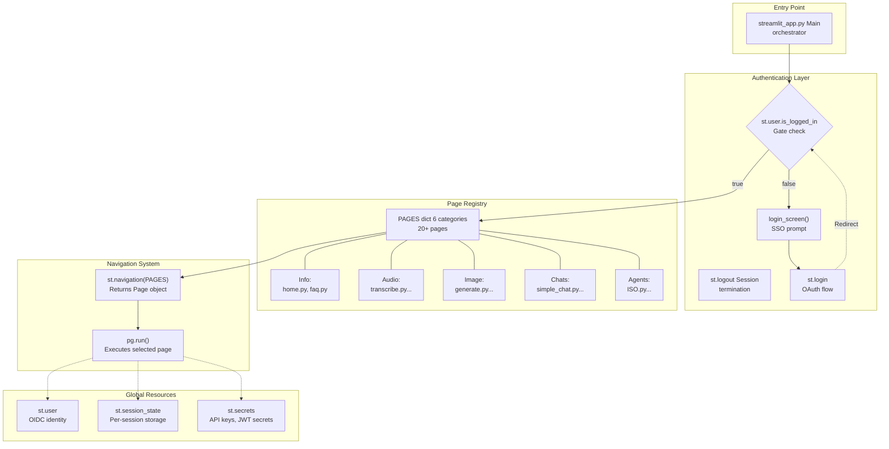
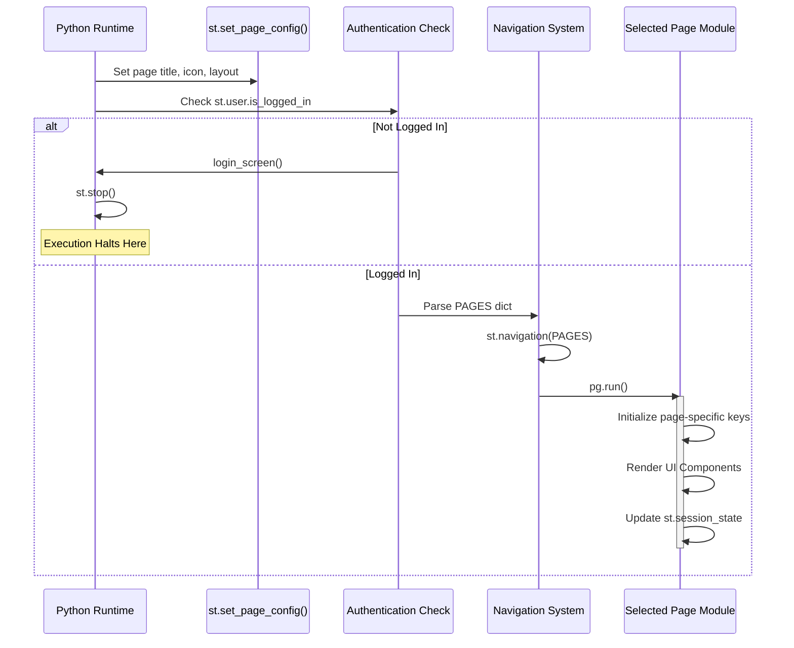
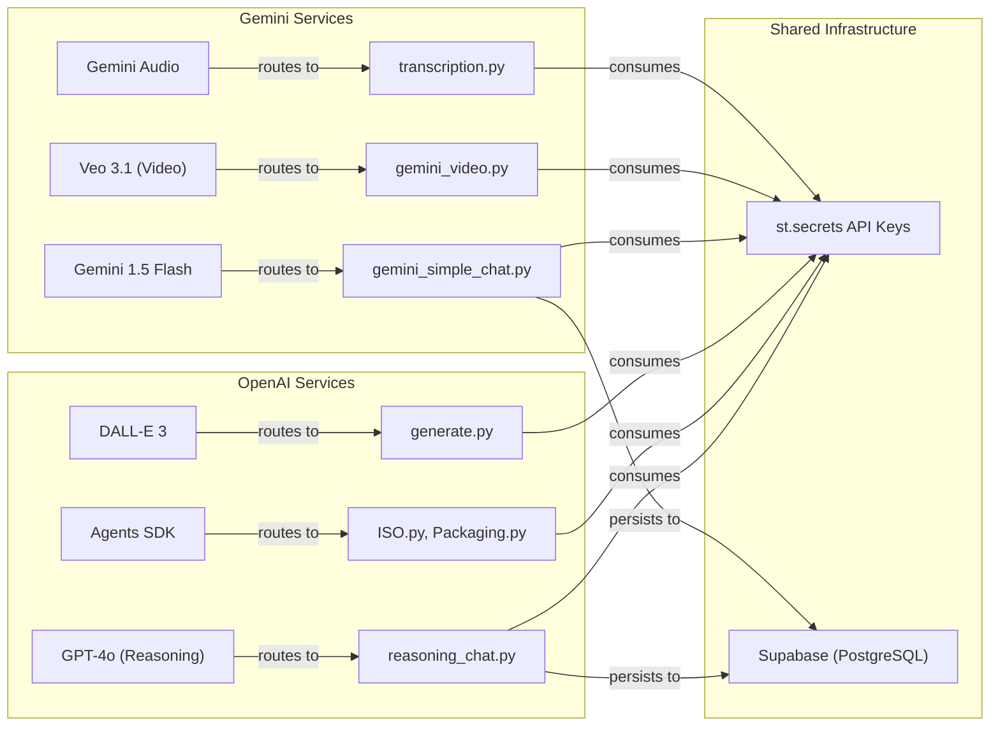

# 🏗️ Gen AI Hub – System Architecture

> **Portfolio Showcase:** An internal, multipage GenAI platform architected for **cross-functional innovation teams** (Designers, Engineers, Strategists).
> This repository demonstrates an **evolving Hub-and-Spoke architecture** built to strict **enterprise-grade standards** (GDPR, SSO, AES-256), serving 20+ specialized AI tools to streamline high-stakes client workflows.

---

## 🔹 TL;DR

- Multipage **Streamlit** application following a **Hub-and-Spoke** architecture.
- **`streamlit_app.py`** is the **single orchestrator**:
  - Handles authentication, page registration, navigation, and global state wiring.
- 20+ tools organized across **six primary domains**:
  - Info, Audio, Image, Chats, Agents, Experimental/Environmental.
- **Authentication-first execution**:
  - If the user is not logged in → login screen + `st.stop()`.
- **Dual-provider strategy**:
  - OpenAI (GPT-4o, o3, Agents SDK, DALL·E 3) for reasoning + advanced text & image.
  - Gemini (Flash, Veo, Audio) for fast multimodal workloads.
- Global resources:
  - `st.user` (OIDC identity), `st.session_state` (per-session context), `st.secrets` (credentials, keys).

---

## 1. Overview
The **Gen AI Hub** (also referenced internally as the *Indeed AI Toolbox*) is a multipage Streamlit application designed as the central entry point for the organization's AI ecosystem.

**Primary Objectives:**
- **Unified Experience:** Consolidates distinct tools into a single, intuitive UX for Designers, Engineers, and Strategists.
- **Provider Agnosticism:** Centralizes access to top-tier models, implementing a dual-provider strategy that routes complex reasoning to **OpenAI** and multimedia tasks to **Google Gemini**.
- **Rapid Evolution:** Supports a workflow-centric lifecycle where new tools can be prototyped and hardened behind stable navigation abstractions without disrupting the core system.

## 2. Security & Architecture
To ensure compliance and data safety, the platform enforces strict enterprise-grade constraints:

- **Authentication:** Access is gated via **Microsoft Entra ID SSO** (Azure AD) .
- **Data Residency:** All data processing is strictly confined to **Germany West Central**.
- **Encryption:** AES-256 encryption is applied at rest across all application layers.
- **Persistence Strategy:**
  - **Stateless Default:** Most tools operate without long-term storage to minimize the data footprint.
  - **Selective Persistence:** Only specific chat implementations (e.g., `simple_chat.py`) persist conversational history via Supabase(Postgres).

## 3. Functional Scope
The Hub currently hosts 20+ functional pages categorized into six core domains:

| Domain | Description | Key Tech/Models |
| :--- | :--- | :--- |
| **Conversational Chat** | Standard chat interfaces and advanced reasoning chains. | OpenAI |
| **Knowledge Agents** | Specialized agents for ISO standards and compliance. | RAG / Embeddings |
| **Audio Transcription** | Automated speech-to-text pipelines. | Whisper / Gemini |
| **Image Generation** | High-fidelity image creation from prompts. | DALL-E / Gemini |
| **Video Generation** | Content creation pipelines. | Google Veo |
| **Sustainability** | Data exploration interfaces for the IDEMAT database. | Data Visualization |

---

## 4. High-Level Hub-and-Spoke Architecture

At the highest level:

- The Hub:
  - `streamlit_app.py` – the **central orchestrator**.
- The Spokes:
  - Individual page modules like `simple_chat.py`, `gemini_simple_chat.py`, `ISO.py`, `generate.py`, `transcription.py`, etc.
- Shared Infrastructure:
  - Authentication
  - Secrets management
  - Supabase persistence (PostgreSQL)
  - AI provider clients

---

## 5. Application Structure Diagram

The application follows a strict execution flow:  
**Entry → Authentication → Page Registry → Navigation → Page Execution → Global Resources**

---

## 6. Application Lifecycle & Initialization

---

## 7. AI Provider Integration Architecture

---

## 8. Global Resources

- `st.user` → OIDC identity  
- `st.session_state` → persistent per-session context  
- `st.secrets` → secure API keys + JWT config  

---

## 9. Extensibility Model

Steps to add a new tool:

1. Create a module (e.g., `my_tool.py`)
2. Implement UI + state logic
3. Register in `PAGES`
4. (Optional) Add to tool card registry + docs

This allows independent evolution of spokes without breaking the Hub.

---

## 10. Related Documents

| File | Description |
|------|-------------|
| [**chat-systems.md**](./docs/chat-systems.md) | Architecture of all chat systems (OpenAI, Gemini, Reasoning, Transcript) |
| [**agents.md**](./docs/agents.md) | ISO Agent, Packaging Agent, Guardrail system |
| [**authentication.md**](./docs/authentication.md) | SSO, JWT, RLS identity mapping |
| [**persistence.md**](./docs/persistence.md) | DB schema, CRUD, auto-purge logic |
| [**heuristics.md**](./docs/heuristics.md) | Gemini auto-thinking heuristics |
| [**provider-routing.md**](./docs/provider-routing.md) | Dual-provider model routing |
| [**patterns.md**](./docs/patterns.md) | Page Registry, Auth Gate, Stateful/Stateless paradigms |
| [**ui-showcase.md**](./docs/ui-showcase.md) | Screenshots, demos, UI visualization |
