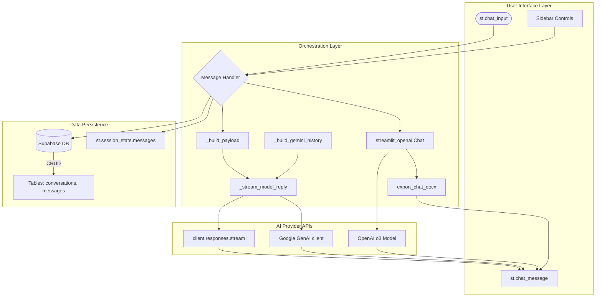
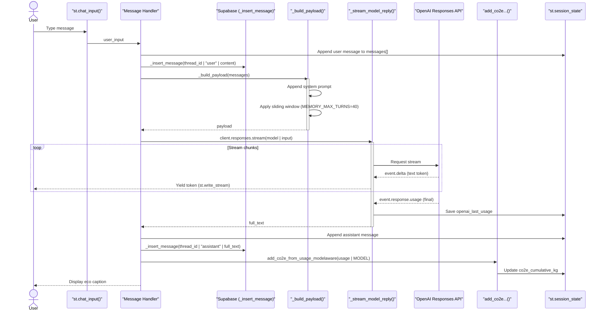
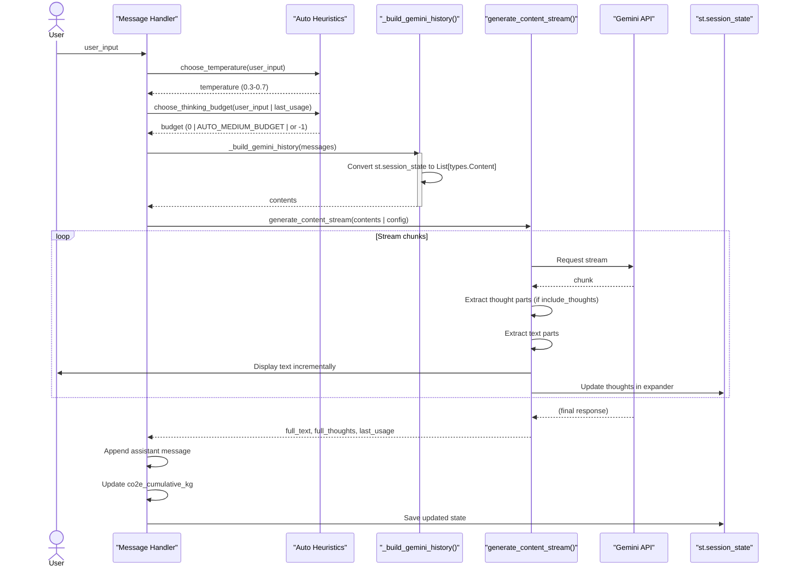

# 💬 Chat Systems

## Purpose and Scope
This document provides a technical overview of the conversational AI interfaces in the Gen AI Hub. The system implements four distinct chat interfaces, each serving different use cases: basic chat with persistence, advanced reasoning with tools, Gemini-powered chat, and transcript-based conversations.

This page focuses on the architectural patterns, data flows, and implementation details common across all chat systems.

## Chat System Overview
The application provides four chat interfaces differentiated by provider, model capabilities, and persistence strategy:

| Chat System | File | Model | Persistence | Key Features |
| :--- | :--- | :--- | :--- | :--- |
| **Simple Chat** | `simple_chat.py` | `gpt-4o-mini` | Supabase (conversations + messages) | Session-based conversation history, CO2e tracking, sliding window context |
| **Reasoning Chat** | `reasoning_chat.py` | `o3-mini` | Session-only | Code interpreter, file search, web search, DOCX export, `streamlit-openai` integration |
| **Gemini Chat** | `gemini_simple_chat.py` | `gemini-2.5-flash` | Supabase (conversations + messages) | Auto-thinking heuristics, dynamic temperature, model-aware CO2e |
| **Transcript Chat** | `transcribe_chat.py` | Various | Session-only | Audio transcript grounding, example prompts |

## High-Level Chat Architecture
The following diagram illustrates the data flow between the User Interface, Message Handlers, Data Persistence (Supabase), and External AI Providers.



## Authentication and Session Management

### Authentication Guard
All chat systems require authentication before execution. Each implements an identical auth guard pattern:

```python
if not getattr(st, "user", None) or not st.user.is_logged_in:
    st.stop()
```

### Key Session State Variables
The application maintains specific state variables to manage context and history across reruns.

| Variable | Used By | Purpose |
| :--- | :--- | :--- |
| `messages` | Simple Chat, Gemini Chat | List of `{"role": str, "content": str}` dicts for chat history |
| `active_thread_id` | Simple Chat, Gemini Chat | UUID of current Supabase conversation record |
| `_starting_new_chat` | Simple Chat, Gemini Chat | Flag indicating user initiated a new blank conversation |
| `reasoning_chat` | Reasoning Chat | `streamlit_openai.Chat` instance with tool configuration |
| `co2e_cumulative_kg` | Simple Chat, Gemini Chat | Running total of carbon emissions for the session |

## Message Processing Flow

### Simple Chat Message Flow
The following sequence diagram details the execution flow for `simple_chat.py`. It demonstrates how the system handles state management, database persistence (Supabase), context windowing, and streaming responses while tracking token usage for carbon footprint calculations.



### Gemini Chat Message Flow

The following sequence diagram details the execution flow for `gemini_simple_chat.py`. It demonstrates how the system dynamically adjusts generation parameters using **Auto Heuristics**, builds context-aware history, and processes the advanced token stream to separately display thought processes.


## Conversation Persistence Architecture

Only **Simple Chat** and **Gemini Chat** implement full database persistence, while **Reasoning Chat** and **Transcript Chat** use session-only storage.

### Database Schema
The persistence layer uses two linked tables in Supabase with a **One-to-Many** relationship, where one conversation (`conversations`) has many messages (`messages`).

```mermaid
graph TD
    subgraph User Interface Layer
        Input(st.chat_input)
        UI_Msg[st.chat_message]
        Sidebar[Sidebar Controls]
    end

    subgraph Orchestration Layer (Gemini Chat)
        Handler[Message Handler]
        
        Handler --> Temp[choose_temperature()]
        Handler --> Budget[choose_thinking_budget()]
        
        Handler --> Persistence[Supabase CRUD]
        
        Handler --> History[_build_gemini_history()]
        
        Handler --> Stream[generate_content_stream()]
    end

    Input --> Handler
    Sidebar --> Handler
    History --> Stream
    
    Stream --> UI_Msg
```
**Row-Level Security (RLS):** Both tables use RLS policies that filter by `user_key`, which is automatically set from the user's JSON Web Token (JWT) `sub` claim during insertion.

### Conversation Management Functions
Both persisted chat systems (`simple_chat.py` and `gemini_simple_chat.py`) implement identical CRUD (Create, Retrieve, Update, Delete) patterns for conversation management.

| Function | Purpose | Key Logic |
| :--- | :--- | :--- |
| `_list_conversations()` | Fetch user's conversations | Orders by `updated_at` DESC, limits to 200 |
| `_get_conversation(conv_id)` | Retrieve single conversation | Returns dict or None |
| `_create_conversation(title)` | Insert new conversation row | Generates UUID, uses DB default for `user_key` |
| `_update_conversation_title_once(conv_id, new_title)` | Only updates title if it matches a placeholder regex pattern | Uses RLS-filtered update |
| `_insert_message(thread_id, role, content)` | Insert message | Triggers `updated_at` bump on parent conversation |
| `_list_messages(thread_id)` | Fetch conversation history | Orders by `created_at` ASC |
| `_delete_conversation(thread_id)` | Hard delete conversation | Cascades to messages via foreign key |
| `_delete_all_my_chats()` | Bulk delete all user conversations | Uses RLS-filtered delete |

## Conversation Title Generation Strategy

The system employs a three-step strategy to generate conversation titles, moving from a simple placeholder to an AI-generated concise title. This ensures that the user always has a meaningful label for their chat history while minimizing LLM calls.

| Step | Functionality | Key Logic |
| :--- | :--- | :--- |
| **1. Initial Title** | Derived from the first line of the user message or a timestamp. | Placeholder format: `"Chat YYYY-MM-DD HH:MM"`. |
| **2. Upgraded Title** | After the first assistant response, a model call generates a concise 4-8 word title. | Uses `_summarize_title_from_first_exchange()`. |
| **3. One-Time Update** | The `_update_conversation_title_once()` function replaces the placeholder only if it matches the initial expected pattern. | This prevents overwriting user-edited titles.

## Gemini Auto-Thinking Heuristics

The `gemini_simple_chat.py` implements dynamic parameter selection based on prompt analysis, minimizing the need for manual user configuration. This is key to ensuring performance and cost control.

### Temperature Selection
The system automatically selects the temperature (`0.3`, `0.4`, or `0.7`) based on pattern matching in the user's prompt.

* If the prompt contains keywords like "brainstorm," "ideas," or "story," the temperature is set to **0.7** (Creative Hints).
* If the prompt contains keywords like "when," "who," or "define," the temperature is set to **0.3** (Fact-based Hints).
* The default temperature is **0.4** (Moderate Creativity).

```python
def choose_temperature(prompt: str) -> float:
    if _matches_any(prompt, _CREATIVE_HINTS):
        return 0.7
    if _matches_any(prompt, _FACTY_HINTS):
        return 0.3
    return 0.4
```

### Thinking Budget Selection
The system protects against cost spikes by dynamically setting the thought budget based on the prompt's complexity and the last request's usage.

* A **Cost Spike Protection** logic triggers if the last response exceeded 20k tokens, capping the next request at the medium budget.
* Prompts matching "simple" patterns return `0` (no budget).
* Prompts matching "hard" or "code math" hints, or prompts over 400 characters, return `AUTO_MEDIUM_BUDGET` or `AUTO_HARD_BUDGET`.

**Constants:**
* `AUTO_MEDIUM_BUDGET = 1024` tokens.
* `AUTO_HARD_BUDGET = -1` (dynamic thinking, no fixed limit).
* `MAX_THOUGHT_BUDGET_CAP = 8192` tokens.
* `COST_SPIKE_TOTAL_TOKENS = 20000` (triggers cost protection).

## 💬 Reasoning Chat Architecture

The Reasoning Chat system implements a stateful tool-use environment and uses the `streamlit-openai` library instead of direct API calls to manage complexity.

### Component Structure
The following diagram illustrates how the Reasoning Chat module integrates the stateful wrapper and configures tool access.

```mermaid
graph TD
    A[reasoning_chat.py] --> B[streamlit_openai.Chat<br>configured with Tools]
    
    subgraph Tool Capabilities
        C1[allow_code_interpreter=True]
        C2[allow_file_search=True]
        C3[allow_web_search=True]
        C4[allow_image_generation=True]
    end

    B --> D[OpenAI o3 model]
    D --> Tools[Tools]
    Tools --> C1
    Tools --> C2
    Tools --> C3
    Tools --> C4
    
    B --> E[_sections list]
    E --> F[export_chat_docx()]
    
    D -.->|API calls| D

    style B fill:#f9f,stroke:#333
```

### Key Behaviors
The `streamlit-openai` wrapper provides several key behaviors that differentiate this chat system:

* **Stateful wrapper:** All conversation state is managed by the `streamlit_openai.Chat` instance.
* **Tool access:** The o3 model can invoke code interpreter, search uploaded files, search the web, and generate images.
* **Block structure:** Responses are stored as `_sections`, each containing multiple `blocks` (text, code, images, reasoning, uploads, downloads).

### Chat Initialization
The chat instance is initialized in `st.session_state` and configured to enable all major tools available to the OpenAI o3 model:

```python
st.session_state.reasoning_chat = streamlit_openai.Chat (
    api_key=api_key,
    model="o3",
    welcome_message="Welcome to the Reasoning Chat! I'm here to assist you with complex reasoning.",
    allow_code_interpreter=True,
    allow_file_search=True,
    allow_web_search=True,
    allow_image_generation=True,
)
```