# 🤖 Specialized Agents & Guardrail Architecture

## Purpose & Scope
This document describes the architecture, design patterns, and execution flow of the **Specialized AI Agents** within the Gen AI Hub — with particular emphasis on the **ISO Standards Agent**, which implements a multi-stage guardrail layer, vector retrieval, and citation-backed RAG synthesis.

This document covers:
- Agent purpose and workflow alignment
- Dual-layer Guardrail pattern (topic validation + schema enforcement)
- RAG pipeline design (vector DB + web search)
- OpenAI Agents SDK integration
- Hallucination prevention strategies
- Mermaid diagrams of full data flow

---

# 1. Overview of Specialized Agents

The system includes multiple agent-driven workflows:

| Agent | File | Purpose | Techniques |
|-------|------|---------|------------|
| **ISO Standards Agent** | `ISO.py` | Provide structured answers for ISO 59020/59010 circularity topics | Guardrail → Vector Search → Web Search → Synthesis |
| **Packaging Agent** | `Packaging.py` | Analyze packaging guidelines, sustainability constraints | Multi-step reasoning + retrieval |
| **Custom Domain Agents** | Various | Workflow-specific assistants for internal teams | Content filtering, schema validation, rule-based gating |

Across these systems, the **Guardrail Pattern** is the defining architectural element.

---

# 2. Why a Guardrail System?

Unlike standard conversational systems, these agents operate in **regulated, domain-constrained environments**, where:

- Hallucinations have real consequences  
- Answers must stay within validated ISO scopes  
- Each response must be **traceable**, **structured**, and **citation-backed**

The guardrail system provides:

### ✔ Topic Validation  
Ensures user queries are actually relevant to circularity standards.

### ✔ Schema Enforcement  
Uses Pydantic models to validate outputs *before* they propagate.

### ✔ Off-Topic Rejection  
Provides deterministic rejection messages with zero hallucination risk.

### ✔ Multi-Source Retrieval  
Vector DB + web search ensures factual grounding.

---

# 3. ISO Agent Architecture (High-Level)

This diagram represents the **full multi-stage data flow** used by the ISO Agent:

```mermaid
graph LR
    User["User Input"] --> Guard["🛡️ Guardrail Agent"]

    Guard -->|Validates Topic| Decision{"Related to<br>Circularity?"}
    
    Decision -- No --> Reject["Return 'Off-Topic' Error"]
    Decision -- Yes --> Main["Main ISO Agent"]

    subgraph "RAG Pipeline"
        Main -->|Query| VectorDB[("Vector Store")]
        Main -->|Search| Web("Tavily API")
        VectorDB & Web --> Synthesis["Citation-Backed Answer"]
    end
```



---

# 4. Guardrail Pattern (Detailed)

The Guardrail Agent is a **pre-processing layer** that determines whether the system should even *engage* the ISO agent.

## 4.1 Pydantic Schema

The guardrail enforces structured outputs:

```python
class ISOQueryOutput(BaseModel):
    is_related: bool
    reason: str
```

This ensures:

- No freeform hallucination
- Boolean decision is always explicit
- Explanation is logged for observability

The guardrail LLM **must** fill this schema — deviations cause retries or rejection.

---

# 5. Main ISO Agent Architecture

Once the Guardrail approves the query, the **Main ISO Agent** executes a structured RAG workflow:

### 5.1 Steps

1. **Query Vector Store**  
   Using pgvector or Qdrant-like structure for:
   - ISO 59020 text embeddings  
   - Circularity-related definitions based on three different ISO Documents
   - PPWR (Packaging and Packaging Waste Regulation Document)
   - Examples from internal datasets  

2. **Run Web Search (Tavily)**  
   Only when:
   - Vector search returns insufficient context  
   - Query requires external validation  

3. **Synthesize final answer**  
   Must:
   - Cite sources  
   - Maintain ISO terminology  
   - Follow output schema for consumers  

---

# 6. Full ISO Agent Pipeline (Detailed Mermaid Diagram)

```mermaid
graph TD
    A[User Query] --> B[Guardrail Agent]

    B -->|is_related=False| OOPS[❌ Off-topic Response Returned]
    B -->|is_related=True| C[Main ISO Agent]

    C --> D1[Retrieve from Vector DB]
    C --> D2[Web Search via Tavily]

    D1 --> E[Combine Evidence]
    D2 --> E

    E --> F[Generate Structured, Citation-backed Answer]
    F --> G[Return to User]
```



---

# 7. Agents SDK Integration

The system uses the **OpenAI Agents SDK**, allowing agents to define:

- Tools  
- Memory policy  
- Retrieval behaviors  
- Schemas  
- Safety filters  

### Example initialization:

```python
agent = client.agents.create(
    model="gpt-4o-agent",
    name="iso_circularity_agent",
    instructions=ISO_INSTRUCTIONS,
    tools=[vector_tool, tavily_tool],
    response_format=ISOAnswerSchema,
)
```

---

# 8. Hallucination Prevention Strategy

The ISO Agent uses **four layers of defense**:

---

## 8.1 Guardrail Topic Filter  
Rejects irrelevant questions **before** any vector or web search.

---

## 8.2 Schema Constrained Output  
Pydantic + response format schema ensures:

- Valid keys  
- No invented fields  
- No narrative drift  

---

## 8.3 Retrieval-Grounded Synthesis  
Model must cite from:

- Vector DB documents  
- Tavily web results  

If citations are invalid → retry with stricter prompt.

---

## 8.4 Deterministic Error Paths  
Off-topic errors do not rely on the LLM; they return a static, safe message.

This eliminates a whole class of hallucinations.

---

# 9. Agent Folder Structure

Recommended file layout:

```
agents/
│
├── ISO.py                 # ISO agent
├── Packaging.py           # Packaging & sustainability workflows
├── instructions/
│   ├── iso_instructions.md
│   └── packaging_instructions.md
├── schemas/
│   └── iso_schema.py
└── utils/
    ├── vector_client.py
    ├── tavily_client.py
    └── guardrail.py
```

---

# 10. Example Guardrail Logic Snippet

```python
def is_circularity_related(prompt: str) -> ISOQueryOutput:
    response = guardrail_model.parse(
        prompt=prompt,
        response_format=ISOQueryOutput
    )
    return response
```

This ensures structured, typed, validated output.

---

# 11. Error Handling and User Messaging

Off-topic response example:

```json
{
  "error": "Query not related to ISO 59020 or circularity topics.",
  "hints": [
    "Ask about material efficiency",
    "Ask about circular flows",
    "Ask about product lifetime extension"
  ]
}
```

This response is deterministic and bypasses LLM generation.

---

# 12. Related Documentation

- **chat-systems.md** — For how agents interact with chat UI  
- **persistence.md** — For logging and session relationships  
- **authentication.md** — For how identity is used to scope RLS  
- **heuristics.md** — For how thinking budgets relate to agent calls  

---