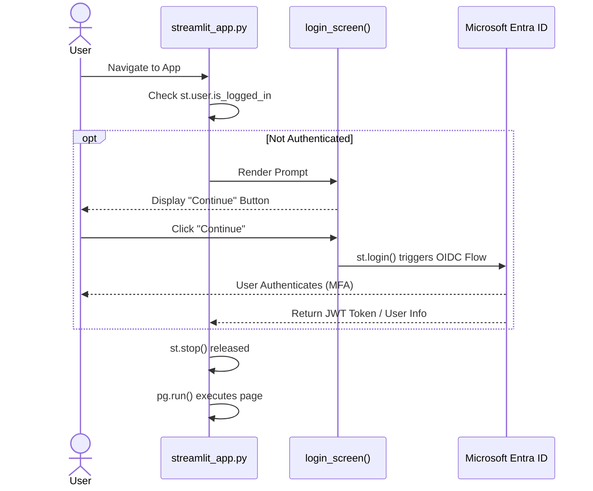

# 🔐 Authentication & Enterprise Security

## Purpose & Scope
This document provides a complete overview of the authentication and security architecture in the **Gen AI Hub (Indeed AI Toolbox)**.  
The authentication layer is **mandatory** and applies to every tool, page, and workflow inside the Hub.

This document covers:

- Microsoft Entra ID (Azure AD) authentication  
- Streamlit SSO integration (`st.login`, `st.user`, `st.logout`)  
- Authentication gate pattern  
- Session termination  
- JWT handling  
- Row-Level Security (RLS) enforcement for Supabase  
- AES-256 encryption across all persistence layers  
- Full authentication flow diagram  

---

# 1. Authentication Philosophy

The system follows a strict **“Authenticate First, Execute Second”** design:

- **No page** may render logic or UI unless the user is authenticated.
- Authentication is enforced at the **entry point** (`streamlit_app.py`).
- Sensitive tools (Agents, RAG workflows, video generation, ISO analysis) rely on an accurate user identity.
- Downstream systems (Supabase) use the authenticated user’s **JWT `sub` claim** for RLS identity mapping.

This ensures:

- Compliance with corporate security policies  
- GDPR alignment  
- Isolation between users (data-scoping)  
- Safe execution of powerful multi-agent workflows  

---

# 2. Authentication Gate Pattern

Every page inherits the same guard pattern:

```python
if not getattr(st, "user", None) or not st.user.is_logged_in:
    login_screen()
    st.stop()
```

Why this works:

- `st.stop()` **halts execution entirely**  
- Prevents partial UI, side-effects, or unauthorized API calls  
- The user must authenticate via the official Entra ID flow  

This pattern applies to:

- Chat systems  
- Agents (ISO, Packaging, domain-specific)  
- Video generation  
- Image generation  
- Audio tools  
- Internal documentation pages  

---

# 3. Full Authentication Flow

This sequence diagram captures: from first page visit → OIDC login → post-authenticated execution.



Key behaviors:

- User never interacts with raw OAuth endpoints.  
- Streamlit handles:
  - Token acquisition  
  - Token refresh  
  - Token revocation  
  - User identity extraction (`st.user`)  

---

# 4. What is `st.user`?

The `st.user` object represents the **authenticated principal**, populated by Streamlit’s native SSO layer.

Common fields:

| Field | Meaning |
|-------|---------|
| `email` | User’s verified corporate email |
| `name` | Full name |
| `id` or `sub` | Unique stable identifier |
| `picture` | Avatar URL (if available) |
| `is_logged_in` | Boolean flag |

### Security-Critical Field: `sub`
- The `sub` claim is the **unique internal identity**.  
- Supabase Row-Level Security (RLS) policies depend on this.  
- Every insert, update, delete is automatically tagged with `user_key = sub`.

---

# 5. Logging Out

Logout is handled by:

```python
st.logout()
```

This:

- Clears authentication state  
- Invalidates session  
- Removes access to all pages  
- Forces redirect to login on reload  

---

# 6. JWT Handling & Supabase Integration

When interacting with Supabase, the system uses:

- Service-level JWT for privileged operations (server → database)
- User-scoped JWT for end-user operations (UI → DB)
- RLS policies limiting DB visibility to:

```sql
user_key = auth.jwt()->>'sub'
```

Meaning each user can only:

- See their own conversations  
- Modify their own rows  
- Delete only their rows  

This is **non-negotiable** for GDPR and internal security compliance.

---

# 7. AES-256 Encryption at Rest

All data is encrypted using **AES-256** end-to-end through the stack:

| Layer | Method | Key Management |
|-------|---------|----------------|
| **Streamlit Secrets** | AES-256 | Managed by Streamlit Encrypted Config System |
| **Azure Blob Storage** | AES-256 | Microsoft-Managed Keys |
| **Supabase PostgreSQL** | AES-256 | Supabase-Managed Keys |

### Notes:
- Encryption is transparent to application code.  
- Decryption only occurs in memory on the running Streamlit instance.  
- Secrets are loaded via `st.secrets`, never stored in the repo.  

---

# 8. Multi-Layer Authorization

Authentication verifies identity.  
**Authorization** determines what a user can do.

The Hub enforces:

### Application-Level Authorization
- Some tools may be restricted by role  
- Role data eventually sourced from Entra ID claims  

### Database-Level Authorization
Enforced via RLS:

- No cross-user visibility  
- No service-level override in UI context  
- Conversation/message data is fully isolated  

### Provider-Level Authorization
API keys stored in:

```toml
[openai]
api_key = "..."

[google]
api_key = "..."

[supabase]
url = "..."
service_role_key = "..."
```

These keys:

- Never appear in client-side code  
- Are resolved only at execution time  
- Are encrypted in transit + at rest  

---

# 9. Early Termination Logic (Why `st.stop()` Matters)

Without `st.stop()`, a malicious or unauthenticated visitor could:

- Trigger downstream compute  
- Invoke OpenAI or Gemini models  
- Cause database writes  
- Access protected tools accidentally  

`st.stop()` guarantees **no further instructions are executed**.


---

# 10. Security Hardening Summary

| Layer | Enforcement | Description |
|-------|-------------|-------------|
| Authentication | Entra ID (OIDC) | MFA + SSO |
| UI Layer | Auth Gate | Stops execution early |
| DB Layer | RLS (user_key) | User-level isolation |
| Storage | AES-256 | Zero plaintext persistence |
| Secrets | Streamlit Secrets | Controlled access |
| Providers | Scoped API Keys | Provider-specific isolation |
| Session | `st.session_state` | Non-persistent unless explicitly written |

---

# 11. Related Documents
| File | Description |
|------|-------------|
| [**architecture.md**](.gen-ai-hub/architecture.MD) | High-level system overview, Hub-and-Spoke architecture, lifecycle diagrams |
| [**chat-systems.md**](./chat-systems.md) | Detailed architecture of all chat interfaces (OpenAI, Gemini, Reasoning Chat, Transcript Chat) |
| [**agents.md**](./agents.md) | ISO Agent and Packaging Agent architectures, Guardrail system, RAG pipeline |
| [**authentication.md**](./authentication.md) | Full authentication flow (Entra ID), SSO, JWT, RLS identity mapping |
| [**persistence.md**](./persistence.md) | Database schema, RLS, CRUD functions, auto-purge retention system |
| [**heuristics.md**](./heuristics.md) | Gemini auto-thinking heuristics (temperature, thought budget, cost protection) |
| [**provider-routing.md**](./provider-routing.md) | Dual-provider routing between OpenAI and Gemini, model selection rules |
| [**patterns.md**](./patterns.md) | Design patterns: Page Registry, Card Registry, Auth Gate, Stateful/Stateless patterns |
| [**ui-showcase.md**](./ui-showcase.md) | Screenshots, videos, and UI demonstrations for all major tools |
---