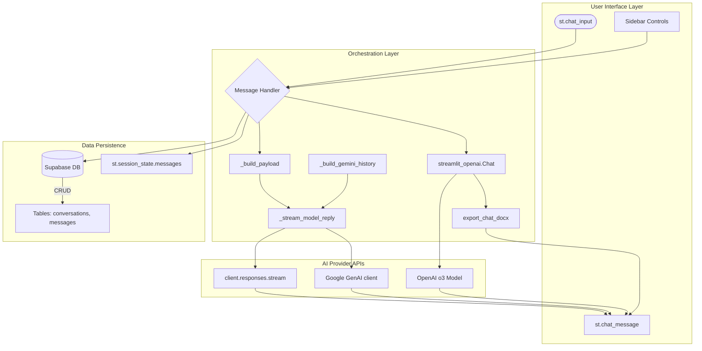
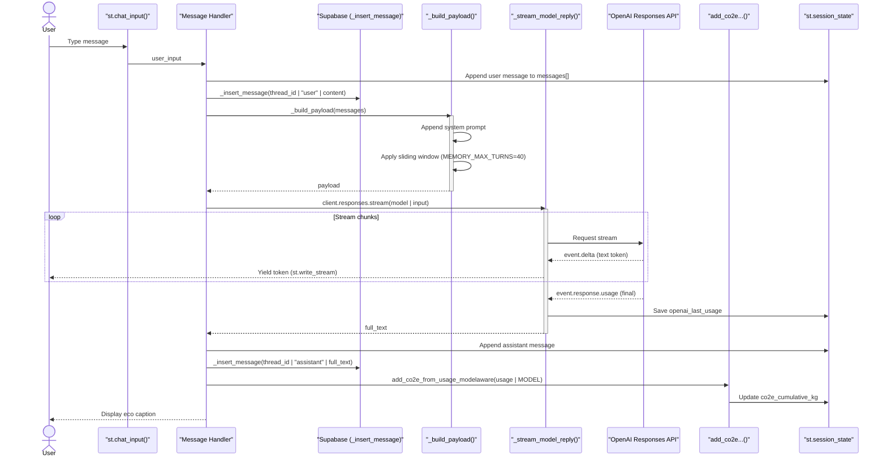
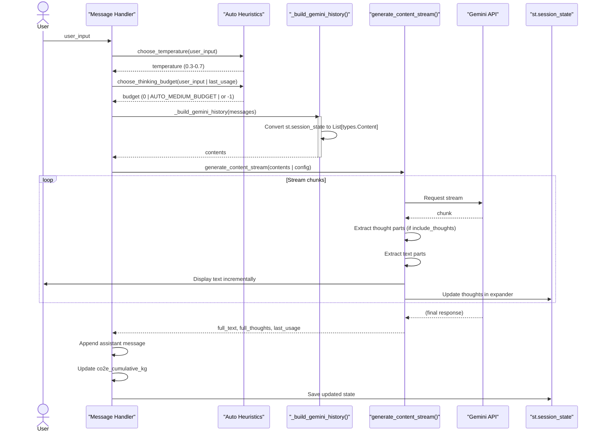
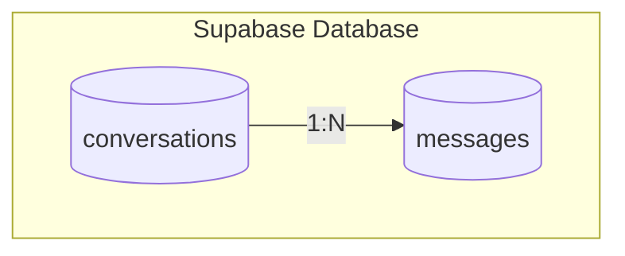
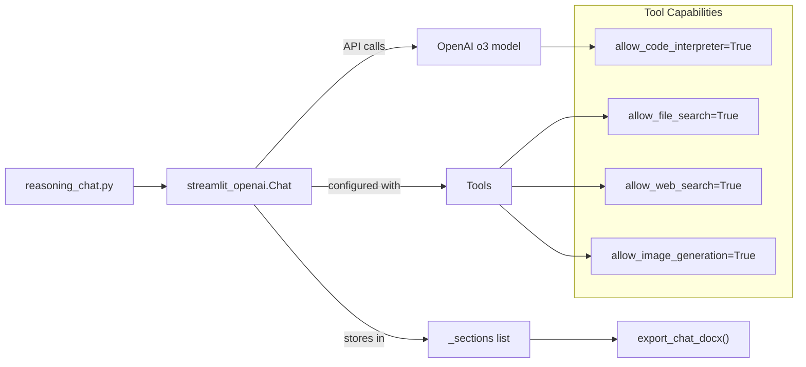

# 💬 Chat Systems

## Purpose and Scope
This document provides a technical overview of the conversational AI interfaces in the Gen AI Hub. The system implements four distinct chat interfaces, each serving different use cases: basic chat with persistence, advanced reasoning with tools, Gemini-powered chat, and transcript-based conversations.

This page focuses on the architectural patterns, data flows, and implementation details common across all chat systems.

## Chat System Overview
The application provides four chat interfaces differentiated by provider, model capabilities, and persistence strategy:

| Chat System | File | Model | Persistence | Key Features |
| :--- | :--- | :--- | :--- | :--- |
| **Simple Chat** | `simple_chat.py` | `gpt-4o-mini` | Supabase (conversations + messages) | Session-based conversation history, CO2e tracking, sliding window context |
| **Reasoning Chat** | `reasoning_chat.py` | `o3-mini` | Session-only | Code interpreter, file search, web search, DOCX export, `streamlit-openai` integration |
| **Gemini Chat** | `gemini_simple_chat.py` | `gemini-2.5-flash` | Supabase (conversations + messages) | Auto-thinking heuristics, dynamic temperature, model-aware CO2e |
| **Transcript Chat** | `transcribe_chat.py` | Various | Session-only | Audio transcript grounding, example prompts |

---

## High-Level Chat Architecture
The following diagram illustrates the data flow between the User Interface, Message Handlers, Data Persistence (Supabase), and External AI Providers.



---

## Authentication and Session Management

### Authentication Guard
All chat systems require authentication before execution. Each implements an identical auth guard pattern:

```python
if not getattr(st, "user", None) or not st.user.is_logged_in:
    st.stop()
```

### Key Session State Variables

| Variable | Used By | Purpose |
| :--- | :--- | :--- |
| `messages` | Simple Chat, Gemini Chat | List of `{"role": str, "content": str}` dicts for chat history |
| `active_thread_id` | Simple Chat, Gemini Chat | UUID of current Supabase conversation record |
| `_starting_new_chat` | Simple Chat, Gemini Chat | Flag indicating user initiated a new blank conversation |
| `reasoning_chat` | Reasoning Chat | `streamlit_openai.Chat` instance with tool configuration |
| `co2e_cumulative_kg` | Simple Chat, Gemini Chat | Running total of carbon emissions for the session |

---

## Message Processing Flow

---

# 🔵 Simple Chat Message Flow

The following sequence diagram details the execution flow for `simple_chat.py`.  
It demonstrates how the system handles:

- State management  
- Database persistence (Supabase)  
- Sliding context window  
- Streaming responses  
- Token usage & carbon footprint tracking  



---

# 🔵 Gemini Chat Message Flow

The `gemini_simple_chat.py` system dynamically adjusts generation parameters using **Auto-Thinking Heuristics**, builds context-aware Gemini-compatible history, and processes a richer token stream containing structured *thoughts* and *outputs*.



---

# 🗄️ Conversation Persistence Architecture

Only **Simple Chat** and **Gemini Chat** implement full database persistence.  
The Reasoning Chat and Transcript Chat remain session-only for security and simplicity.

---

## Database Schema (Supabase / PostgreSQL)



### Row-Level Security (RLS)

- Conversations and messages are filtered via `user_key`  
- The `sub` claim in the user's JWT automatically applies identity scoping  
- Enforced on all inserts, updates, deletes, and selects  

---

## Conversation Management Functions

| Function | Purpose | Key Logic |
| :--- | :--- | :--- |
| `_list_conversations()` | Fetch user's conversations | Ordered by `updated_at DESC`, limit 200 |
| `_get_conversation()` | Fetch single conversation by ID | RLS filters by user |
| `_create_conversation()` | Creates new conversation entry | Uses UUID; user_key implicitly added |
| `_update_conversation_title_once()` | Generates short title | Only updates if title still placeholder |
| `_insert_message()` | Writes message to DB | Also updates parent `updated_at` |
| `_list_messages()` | Loads history for UI | Ordered by `created_at ASC` |
| `_delete_conversation()` | Hard-delete conversation | Cascades to messages |
| `_delete_all_my_chats()` | Bulk deletion | RLS ensures only user rows deleted |

---

# 📝 Conversation Title Generation Strategy

Three-stage upgrade strategy:

| Step | Purpose |
|---|---|
| **1. Initial Title** | Using first-line summary or timestamp placeholder |
| **2. AI Upgrade** | After assistant reply → summarize to 4–8 word title |
| **3. One-Time Update** | Only updates if placeholder still matches pattern (regex) |

Ensures efficiency:  
- Low API usage  
- Stable, user-editable titles  

---

# 🧠 Gemini Auto-Thinking Heuristics

The **Gemini Chat** dynamically selects:

- Temperature  
- Thinking budget  
- Safety blocks  
- Model configuration  

## Temperature Logic

```python
def choose_temperature(prompt: str) -> float:
    if _matches_any(prompt, _CREATIVE_HINTS):
        return 0.7
    if _matches_any(prompt, _FACTY_HINTS):
        return 0.3
    return 0.4
```

## Thinking Budget Logic

- 0 → For simple, factual queries  
- `AUTO_MEDIUM_BUDGET = 1024` → For moderately complex reasoning  
- `AUTO_HARD_BUDGET = -1` → Fully dynamic budget  
- **Cost spike protection:**  
  If last token usage > 20k → Downshift next request  

Constants:

- `MAX_THOUGHT_BUDGET_CAP = 8192`  
- `COST_SPIKE_TOTAL_TOKENS = 20000`  

---

# 🤖 Reasoning Chat Architecture

The Reasoning Chat system uses **streamlit-openai** as a wrapper to provide:

- Tool use  
- Code interpreter  
- File search  
- Web search  
- Image generation  
- DOCX export  

## Component Diagram



## Initialization

```python
st.session_state.reasoning_chat = streamlit_openai.Chat(
    api_key=api_key,
    model="o3",
    welcome_message="Welcome to the Reasoning Chat! I'm here to assist you with complex reasoning.",
    allow_code_interpreter=True,
    allow_file_search=True,
    allow_web_search=True,
    allow_image_generation=True,
)
```

---
# Related Documents
| File | Description |
|------|-------------|
| [**architecture.md**](.gen-ai-hub/architecture.MD) | High-level system overview, Hub-and-Spoke architecture, lifecycle diagrams |
| [**chat-systems.md**](./chat-systems.md) | Detailed architecture of all chat interfaces (OpenAI, Gemini, Reasoning Chat, Transcript Chat) |
| [**agents.md**](./agents.md) | ISO Agent and Packaging Agent architectures, Guardrail system, RAG pipeline |
| [**authentication.md**](./authentication.md) | Full authentication flow (Entra ID), SSO, JWT, RLS identity mapping |
| [**persistence.md**](./persistence.md) | Database schema, RLS, CRUD functions, auto-purge retention system |
| [**heuristics.md**](./heuristics.md) | Gemini auto-thinking heuristics (temperature, thought budget, cost protection) |
| [**provider-routing.md**](./provider-routing.md) | Dual-provider routing between OpenAI and Gemini, model selection rules |
| [**patterns.md**](./patterns.md) | Design patterns: Page Registry, Card Registry, Auth Gate, Stateful/Stateless patterns |
| [**ui-showcase.md**](./ui-showcase.md) | Screenshots, videos, and UI demonstrations for all major tools |