# 🧠 Gemini Auto-Thinking Heuristics

## Purpose & Scope

This document details the **Gemini Auto-Thinking Heuristics System** implemented in:

- `gemini_simple_chat.py`

The heuristics dynamically adjust:

- Temperature  
- Thought budget (dynamic budget for chain-of-thought–style reasoning)  
- Safety behaviors  
- Cost-protection rules  
- Token budget limits  

This system makes the Gemini chat experience:

- More responsive  
- More cost-efficient  
- More intelligent  
- More predictable  

All without requiring the user to configure model parameters manually.

---

# 1. Overview of the Heuristic System

Gemini Flash/Pro 2.5 models support **adaptive reasoning tokens** (“thinking tokens”).  
Excessive thought generation can:

- Increase latency  
- Dramatically increase token costs  
- Provide reasoning when it isn’t needed  

The heuristic system solves this by:

| Stage | Purpose |
|-------|---------|
| **1. Prompt Classification** | Determine task type (creative, factual, complex) |
| **2. Temperature Selection** | Adjust model creativity |
| **3. Budget Computation** | Allocate allowable thought tokens |
| **4. Cost Spike Protection** | Enforce safety caps after expensive calls |
| **5. Max-cap Enforcement** | Prevent runaway chain-of-thought |

These steps run **on every user input**.

---

# 2. Temperature Selection Logic

The system maintains two core keyword maps:

### **Creative Keywords → temperature = 0.7**
- "brainstorm"
- "ideas"
- "story"
- "expand"
- "creative"
- "imagine"

### **Fact-based Keywords → temperature = 0.3**
- "define"
- "explain"
- "who"
- "when"
- "what"
- "citation"
- "iso", "standard", etc.

### Default → **0.4**

### Implementation

```python
def choose_temperature(prompt: str) -> float:
    if _matches_any(prompt, _CREATIVE_HINTS):
        return 0.7
    if _matches_any(prompt, _FACTY_HINTS):
        return 0.3
    return 0.4
```

Key characteristics:

- Deterministic  
- Cheap to compute  
- Avoids unnecessarily creative reasoning  
- Reduces hallucination risk for ISO / regulated domains  

---

# 3. Thinking-Budget Heuristics

Gemini supports model-defined budget via:

- `AUTO_MEDIUM_BUDGET = 1024`
- `AUTO_HARD_BUDGET = -1` (open budget)
- `MAX_THOUGHT_BUDGET_CAP = 8192`

The heuristic determines how much chain-of-thought reasoning the model is allowed to allocate.

## 3.1 Prompt Length Rule

```
if len(prompt) > 400 characters:
    budget = AUTO_HARD_BUDGET
```

Rationale:

- Long prompts often contain multi-step tasks.
- Hard cap still applies (`MAX_THOUGHT_BUDGET_CAP`).

## 3.2 Keyword Classification

### **Simple Tasks** → no thought budget  
Examples:

- Define X  
- Convert Y  
- Short factual Q&A  

→ `budget = 0`

### **Hard Keywords** → medium or hard budget  
Includes:

- "analyze"
- "diagnose"
- "solve"
- "mathematical"
- "pseudocode"
- "multi-step"
- "design a workflow"

→ `budget = AUTO_MEDIUM_BUDGET` or `AUTO_HARD_BUDGET`

---

# 4. Cost Spike Protection

Gemini’s internal token accounting can occasionally cause cost spikes.  
To handle this, we record:

```
st.session_state.last_usage
```

If the last request had **over 20,000 tokens** consumed:

```
COST_SPIKE_TOTAL_TOKENS = 20000
```

then:

```
next_budget = AUTO_MEDIUM_BUDGET
```

This prevents accidental:

- Runaway chain-of-thought loops  
- Excessive latency  
- Sudden cost escalation  

---

# 5. Global Budget Cap

Regardless of the user's prompt:

```
if budget > MAX_THOUGHT_BUDGET_CAP:
    budget = MAX_THOUGHT_BUDGET_CAP   # prevents runaway reasoning
```

This is defensive programming because Gemini 2.5 Flash may allocate large thought budgets if left unrestricted.

---

# 6. Combined Heuristic Flow Diagram

```mermaid
graph TD
    A[User Prompt] --> B[Classify Prompt]

    B -->|Creative Keywords| TempHigh[Temperature = 0.7]
    B -->|Fact Keywords| TempLow[Temperature = 0.3]
    B -->|Default| TempMid[Temperature = 0.4]

    A --> C[Estimate Complexity]

    C -->|Short / Simple| Budget0[Budget = 0]
    C -->|Medium Complexity| BudgetMed[AUTO_MEDIUM_BUDGET]
    C -->|Long / Hard| BudgetHard[AUTO_HARD_BUDGET]

    D[Check Last Usage] -->|> 20k tokens| SpikeProtect[Reduce to AUTO_MEDIUM_BUDGET]

    Budget0 --> E[Apply Max Cap]
    BudgetMed --> E
    BudgetHard --> E
    SpikeProtect --> E

    E --> F[Final Config → Gemini API]
```



---

# 7. Full Streaming Behavior Interaction

The heuristics tie into the custom streaming loop:

- Thoughts are extracted separately  
- Displayed in collapsible UI containers  
- Not stored unless user opts into export  
- Ensures that **chain-of-thought is never leaked into production responses**  

Gemini returns structured streaming chunks:

```
chunk.thought
chunk.text
chunk.safety
chunk.metadata
```

Logic:

```python
if part.thought:
    update_thought_expander(...)
if part.text:
    yield_to_ui(...)
```

This maintains:

- Transparency  
- User control  
- Performance  
- Safety  

---

# 8. Example Final Configuration Passed to Gemini

```python
response = client.generate_content_stream(
    model="gemini-2.5-flash",
    contents=contents,
    generation_config={
        "temperature": temperature,
        "max_output_tokens": 8192,
        "thinking": {
            "budget_tokens": budget
        }
    }
)
```

---

# 9. How Heuristics Improve User Workflow

### ✔ No need for user to understand model parameters  
### ✔ Cheap tasks are cheap  
### ✔ Complex reasoning gets enough budget  
### ✔ Sudden cost spikes are avoided  
### ✔ Creative tasks feel creative  
### ✔ Regulated tasks stay factual  

This is especially useful for:

- ISO workflows  
- Packaging workflows  
- Knowledge extraction  
- Data transformation  
- Brainstorming sessions  

---

# 10. Constants Used in the System

```python
AUTO_MEDIUM_BUDGET = 1024
AUTO_HARD_BUDGET = -1  # Dynamic, model chooses
MAX_THOUGHT_BUDGET_CAP = 8192
COST_SPIKE_TOTAL_TOKENS = 20000
```

Keywords:

```python
_CREATIVE_HINTS = [...]
_FACTY_HINTS = [...]
_HARD_HINTS = [...]
_SIMPLE_HINTS = [...]
```

Prompts are normalized (lowercase + stripped) before comparison.

---

# 11. Related Documentation

| File | Description |
|------|-------------|
| [**architecture.md**](../architecture.md) | High-level system overview, Hub-and-Spoke architecture, lifecycle diagrams |
| [**chat-systems.md**](./chat-systems.md) | Architecture of all chat systems (OpenAI, Gemini, Reasoning, Transcript) |
| [**agents.md**](./agents.md) | ISO Agent, Guardrail system, RAG pipeline, Packaging Agent |
| [**authentication.md**](./authentication.md) | Entra ID SSO, JWT identity mapping, RLS integration |
| [**persistence.md**](./persistence.md) | Supabase schema, CRUD functions, auto-purge retention logic |
| [**heuristics.md**](./heuristics.md) | Gemini auto-thinking heuristics (temperature, budgets, cost protection) |
| [**provider-routing.md**](./provider-routing.md) | Dual-provider routing between OpenAI & Gemini |
| [**patterns.md**](./patterns.md) | Core design patterns across the Hub |
| [**ui-showcase.md**](./ui-showcase.md) | Screenshots, video demo references, UI patterns |
---
