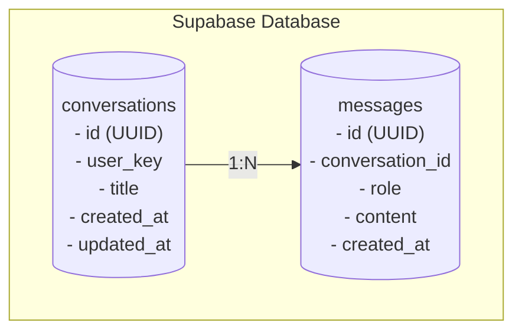
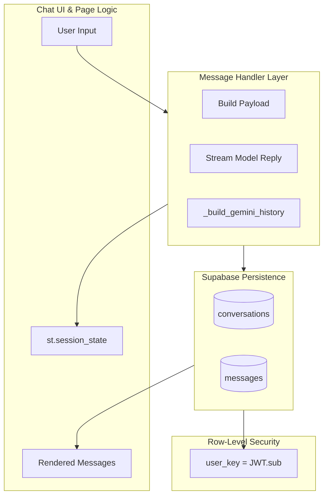

# 💾 Persistence Architecture (Supabase + Session Layer)

## Purpose & Scope
This document describes the complete persistence model for the **Gen AI Hub**, covering:

- Conversation & message storage (Supabase PostgreSQL)
- Session-only vs. DB-backed chat modes
- RLS (Row-Level Security) identity enforcement
- Conversation title upgrade flow
- CRUD functions for both chats
- Auto-purge data retention system (as requested)
- Schema diagrams (Mermaid)

This file preserves the exact technical depth of the implementation.

---

# 1. Persistence Philosophy

The Hub follows a **Selective Persistence Model**:

| Component | Persistence Strategy | Reason |
|----------|-----------------------|--------|
| Simple Chat | Full DB persistence | Long-term history, multi-session continuity |
| Gemini Chat | Full DB persistence | CO₂ tracking continuity, cross-session chat history |
| Reasoning Chat | Session-only | Tool responses may contain sensitive artifacts (code, files) |
| Transcript Chat | Session-only | Audio transcripts not stored for GDPR reasons |

This ensures the Hub only stores what is explicitly required for user workflows while minimizing long-term footprint.

---

# 2. Database Schema (Supabase / PostgreSQL)

The system uses two linked tables:

- **`conversations`** — One row per conversation thread
- **`messages`** — Multiple messages per conversation



Properties:

- All writes go through server-side PostgREST.
- All rows are encrypted at rest with **AES-256**.
- RLS ensures users can only see their own data (see Section 4).

---

# 3. Session vs Persistent Storage

## Session-Based Storage (`st.session_state`)

Used by:

- `reasoning_chat.py`  
- `transcribe_chat.py`  

Session entries include:

```
messages
co2e_cumulative_kg
reasoning_chat
_starting_new_chat
```

Nothing written to disk unless explicitly persisted.

---

## DB-Backed Storage (Supabase)

Used by:

- `simple_chat.py`
- `gemini_simple_chat.py`

Records stored:

| Field | Description |
|-------|-------------|
| `conversation_id` | Thread identifier |
| `role` | "user" or "assistant" |
| `content` | Markdown / plain text content |
| `created_at` | Server timestamp |
| `updated_at` | Updated on any message insert |

---

# 4. Row-Level Security (RLS)

Supabase enforces RLS for all tables.  
Every row includes a `user_key` automatically tied to JWT `sub`.

### RLS Policy Example (Conceptual)

```sql
CREATE POLICY "Users can manage their own conversations"
ON conversations
FOR ALL
USING (user_key = auth.jwt()->>'sub')
WITH CHECK (user_key = auth.jwt()->>'sub');
```

This ensures:

- No cross-user visibility  
- No session spoofing  
- No accidental leakage even from admin UI  

---

# 5. CRUD Functions

### `_list_conversations()`

- Returns the user’s conversations  
- Ordered by `updated_at DESC`  
- Limit of 200  

### `_get_conversation(conv_id)`

- Retrieves a single conversation  
- Respects RLS → returns None if unauthorized  

### `_create_conversation(title)`

- Creates a new conversation  
- `user_key` assigned automatically via JWT claim  
- Timestamp handled by DB defaults  

### `_update_conversation_title_once(conv_id, new_title)`

- Upgrades title only if it matches placeholder pattern  
- Prevents overwriting manual edits  

### `_insert_message(thread_id, role, content)`

- Inserts user or assistant message  
- Automatically updates parent `updated_at`  
- Enables sorting by most recent activity  

### `_delete_conversation(thread_id)`

- Deletes both conversation + messages via cascade  
- Fully compliant with "right to erase"  

### `_delete_all_my_chats()`

- Bulk delete  
- RLS ensures each user only deletes *their own* rows  

---

# 6. Conversation Title Upgrade Strategy

The Hub ensures meaningful titles with minimal model calls.

### Step 1 — Initial Placeholder

Examples:

- `"Chat 2025-01-21 14:33"`  
- First line of user query  

### Step 2 — Upgrade with LLM

After assistant's first reply:

- Extracts topic in 4–8 words  
- Uses small model (gpt-4o-mini or Gemini Flash)  

### Step 3 — One-Time Update (Regex Guard)

Ensures LLM upgrade happens only if:

```
title matches "^Chat\s\d{4}-\d{2}-\d{2}"
```

Prevents messing with user-edited titles.

---

# 7. Auto-Purge Retention Policy (NEW)

The Hub includes an **Automatic Data Purge System**  
to comply with GDPR data minimization standards.

## 7.1 Retention Window  
By default:

```
Conversations older than 30 days are purged.
```


## 7.2 How Auto-Purge Works

### Server-Side Scheduled Job (Supabase Cron)

Supabase supports scheduled tasks via **pg_cron**.

Example conceptual query:

```sql
SELECT * FROM cron.schedule(
    'daily_conversation_purge',
    '0 2 * * *',  -- every day at 02:00
    $$
    DELETE FROM conversations
    WHERE updated_at < NOW() - INTERVAL '30 days';
    $$
);
```

This cascades to messages due to foreign key constraints.

### 7.3 Client-Side Safeguards

In chat UIs:

- Threads that have been auto-purged will no longer appear in `_list_conversations()`
- Missing thread loads gracefully fall back to an empty chat session
- Error states are nondestructive and user-friendly

### 7.4 GDPR Alignment

Auto-purge ensures:

- No long-term retention of sensitive data  
- No implicit profiling or behavioral tracking  
- Users have automated + manual deletion paths  

---

# 8. Eco-Tracking Storage (CO₂ Budget)

For Simple Chat and Gemini Chat:

- Model usage tokens → CO₂ kg estimate  
- Stored **per session**  

Stored in:

```
st.session_state.co2e_cumulative_kg
```

This contributes to sustainability reporting without requiring personal data retention.

---

# 9. Full Persistence Architecture Diagram



---

# 10. File Structure (Recommended)

```
docs/
│
├── persistence.md
├── chat-systems.md
├── authentication.md
└── agents.md
```

Runtime modules:

```
simple_chat.py
gemini_simple_chat.py
supabase_client.py
```

---

# 11. Related Documents

| File | Description |
|------|-------------|
| [**architecture.md**](.gen-ai-hub/architecture.MD) | High-level system overview, Hub-and-Spoke architecture, lifecycle diagrams |
| [**chat-systems.md**](./chat-systems.md) | Detailed architecture of all chat interfaces (OpenAI, Gemini, Reasoning Chat, Transcript Chat) |
| [**agents.md**](./agents.md) | ISO Agent and Packaging Agent architectures, Guardrail system, RAG pipeline |
| [**authentication.md**](./authentication.md) | Full authentication flow (Entra ID), SSO, JWT, RLS identity mapping |
| [**persistence.md**](./persistence.md) | Database schema, RLS, CRUD functions, auto-purge retention system |
| [**heuristics.md**](./heuristics.md) | Gemini auto-thinking heuristics (temperature, thought budget, cost protection) |
| [**provider-routing.md**](./provider-routing.md) | Dual-provider routing between OpenAI and Gemini, model selection rules |
| [**patterns.md**](./patterns.md) | Design patterns: Page Registry, Card Registry, Auth Gate, Stateful/Stateless patterns |
| [**ui-showcase.md**](./ui-showcase.md) | Screenshots, videos, and UI demonstrations for all major tools |
---
