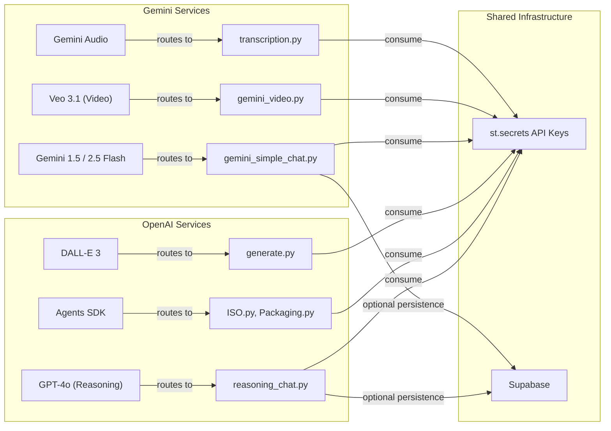
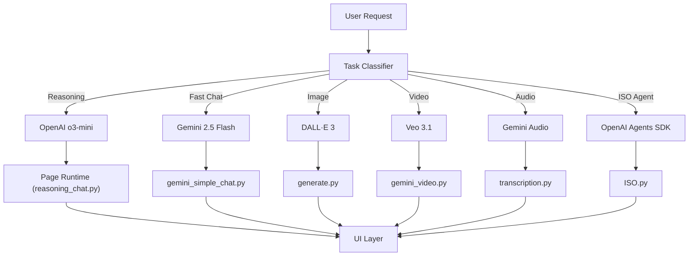

# 🚦 AI Provider Routing Strategy

## Purpose & Scope
This document explains the **Dual-Provider Architecture** used in the Gen AI Hub, describing:

- Why OpenAI and Gemini are both used  
- How requests are dynamically routed  
- Which models power which workflows  
- System-level incentives (cost, speed, multimodal capabilities)  
- Provider abstraction strategy  
- Diagrams showing full routing flow  

This ensures consistent behavior across 20+ internal tools while leveraging each provider’s strengths.

---

# 1. Why a Dual-Provider Strategy?

The Gen AI Hub supports diverse workflows:

| Category | Needs | Best Provider |
|---------|--------|----------------|
| **Reasoning / Agents** | High accuracy, tools, code, file search | **OpenAI (o3 / GPT-4o)** |
| **Fast Chat** | Minimal latency, low cost | **Gemini 2.5 Flash** |
| **Video Generation** | High-quality video output | **Gemini Veo 3.1** |
| **High-Speed Transcription** | Audio-native APIs | **Gemini Audio** |
| **Image Generation** | Branding tools, quality prompts | **DALL·E 3** |
| **ISO Agents / RAG** | Agent SDK, pydantic schemas | **OpenAI Agents SDK** |

The architecture ensures:

- Optimal performance per task  
- Reduced operational cost  
- Model specialization  
- Flexible evolution of future tooling  

---

# 2. High-Level Routing Diagram



---

# 3. Routing Rules by Domain

## 3.1 Conversational Systems

| Chat Type | Provider | Reason |
|----------|----------|--------|
| **Simple Chat** | OpenAI (`gpt-4o-mini`) | Best blend of accuracy + cost |
| **Gemini Fast Chat** | Gemini Flash | Lowest latency for ideation workflows |
| **Reasoning Chat** | OpenAI (`o3`) | Best for multistep reasoning |
| **Transcript Chat** | Gemini Audio | Authored for speech-to-text |

---

# 4. Routing Logic (Detailed)

All chat modules rely on a provider-selection layer.

### **OpenAI is selected when:**

- Multi-step reasoning is required  
- Tool use is needed (code interpreter, image generation, file search, web search)  
- Pydantic schema outputs are required  
- Hallucination control must be strict  
- High-fidelity ISO compliance needed  

### **Gemini is selected when:**

- High throughput, low latency is desired  
- Auto-thinking heuristics are beneficial  
- Video generation is required (Veo)  
- Token efficiency is critical  
- Context window needs are large  

---

# 5. Model Selection Table

| Use Case | Model | Provider | Notes |
|----------|--------|----------|-------|
| Fast standard chat | `gemini-2.5-flash` | Google | Fastest, cheapest |
| Chat w/ persistence | `gpt-4o-mini` | OpenAI | Balanced choice |
| Complex reasoning | `o3-mini` | OpenAI | Dedicated reasoning model |
| ISO Agent | `gpt-4o-agent` | OpenAI Agents SDK | With guardrail + RAG |
| Image generation | `dall-e-3` | OpenAI | High-quality |
| Transcription | Gemini Audio APIs | Google | Speech-first models |
| Video generation | `veo-3.1` | Google | Native multimodal chain |
| Markdown summarization | `gpt-4o-mini` | OpenAI | Minimal hallucination |
| Knowledge agents | OpenAI Agents SDK | OpenAI | Deterministic tooling |

---

# 6. Routing Logic Implementation (Conceptual)

This pattern is used by chat systems and tool modules.

### `provider_router.py` (conceptual)

```python
def get_model_for_task(task: str):
    if task == "reasoning":
        return ("openai", "o3-mini")
    if task == "fast_chat":
        return ("gemini", "gemini-2.5-flash")
    if task == "image_generation":
        return ("openai", "dall-e-3")
    if task == "video_generation":
        return ("gemini", "veo-3.1")
    if task == "agent_iso":
        return ("openai", "gpt-4o-agent")
```

Called inside each page module.

---

# 7. Provider Tradeoff Analysis

| Dimension | OpenAI Strengths | Gemini Strengths |
|-----------|------------------|------------------|
| **Latency** | ❌ Sometimes higher | ✅ Ultra fast flash models |
| **Reasoning** | ✅ Best (o3) | ⚪ Good, but not top tier |
| **Multimodality** | ⚪ Strong | ✅ Native video/audio |
| **Cost Efficiency** | ⚪ Moderate | ✅ Very high |
| **Agent SDK** | ✅ Advanced | ⚪ Limited |
| **Strict schema adherence** | ✅ Best-in-class | ⚪ Improving |
| **Streaming features** | Strong | Strong (with thoughts) |

Key takeaway:

> **OpenAI for correctness, Gemini for speed.**

---

# 8. Error Handling & Fallback Strategy

If a provider fails (timeout/API outage):

### 1. Retry Against Same Provider  
Using exponential backoff.

### 2. Failover (when allowed)  

Example:

- Gemini Flash unreachable → fall back to `gpt-4o-mini`  
- DALL·E error → retry with image size fallback  
- O3 unresponsive → switch to GPT-4o for emergency reasoning  

### 3. UI Surface  
User sees:
- A friendly warning banner  
- A retry button  
- No stack traces  

---

# 9. Full Routing Architecture (Mermaid)



---

# 10. Secrets Management (Provider Neutral)

All provider keys are stored in:

```
st.secrets["openai"]["api_key"]
st.secrets["google"]["api_key"]
st.secrets["supabase"]["service_role_key"]
```

Keys are:

- AES-256 encrypted at rest  
- Never embedded in code  
- Never sent to users  
- Scoped to least privilege  

---

# 11. Relationship to Other Documents

| File | Description |
|------|-------------|
| [**architecture.md**](../architecture.md) | High-level system overview, Hub-and-Spoke architecture, lifecycle diagrams |
| [**chat-systems.md**](./chat-systems.md) | Architecture of all chat systems (OpenAI, Gemini, Reasoning, Transcript) |
| [**agents.md**](./agents.md) | ISO Agent, Guardrail system, RAG pipeline, Packaging Agent |
| [**authentication.md**](./authentication.md) | Entra ID SSO, JWT identity mapping, RLS integration |
| [**persistence.md**](./persistence.md) | Supabase schema, CRUD functions, auto-purge retention logic |
| [**heuristics.md**](./heuristics.md) | Gemini auto-thinking heuristics (temperature, budgets, cost protection) |
| [**provider-routing.md**](./provider-routing.md) | Dual-provider routing between OpenAI & Gemini |
| [**patterns.md**](./patterns.md) | Core design patterns across the Hub |
| [**ui-showcase.md**](./ui-showcase.md) | Screenshots, video demo references, UI patterns |

---