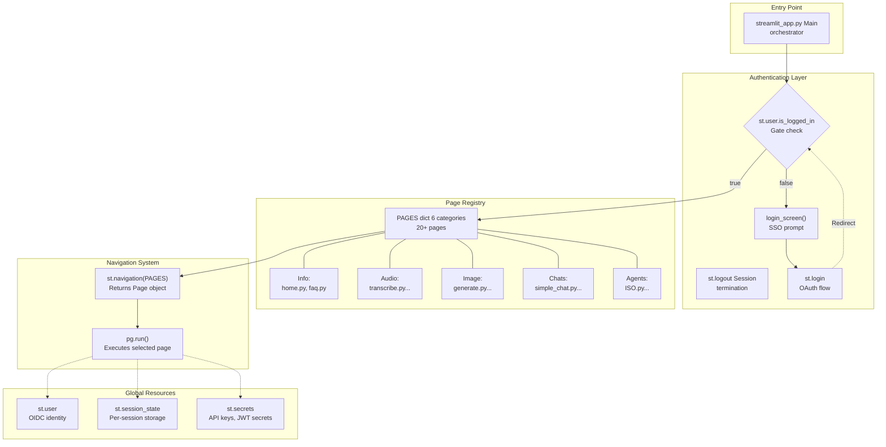
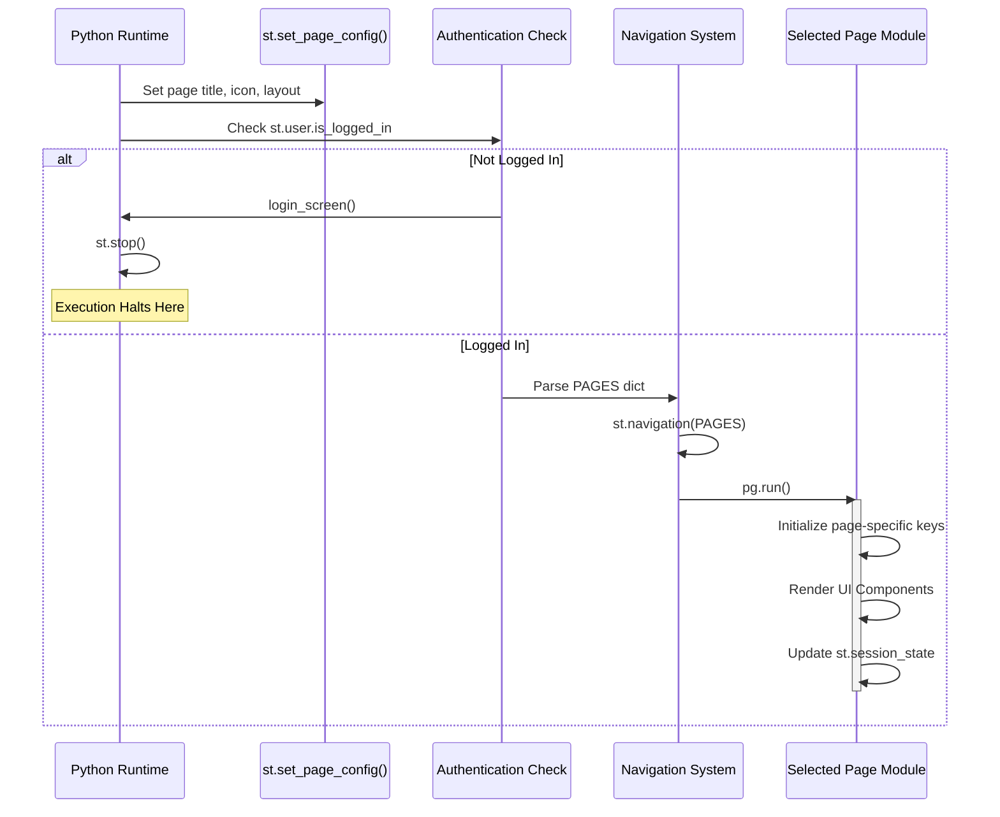
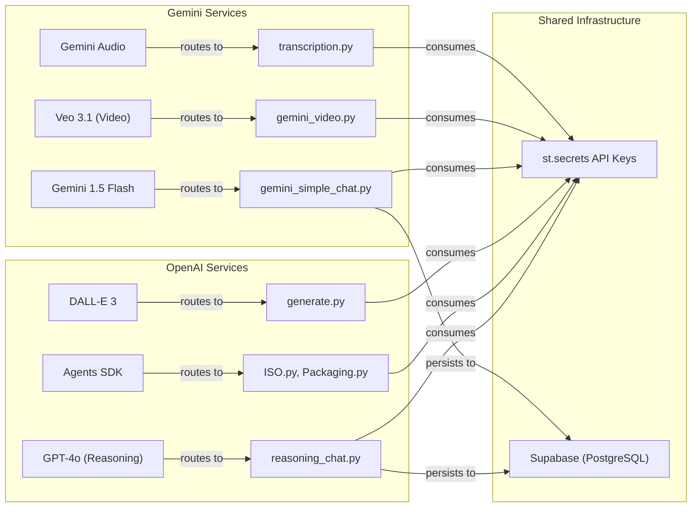

# 🏗️ Gen AI Hub – System Architecture

> This document describes the complete architecture of the **Gen AI Hub (Indeed AI Toolbox)**, including its hub-and-spoke layout, lifecycle flow, navigation, and AI provider integration.

---

## 🔹 TL;DR

- Multipage **Streamlit** application following a **Hub-and-Spoke** architecture.
- **`streamlit_app.py`** is the **single orchestrator**:
  - Handles authentication, page registration, navigation, and global state wiring.
- 20+ tools organized across **six primary domains**:
  - Info, Audio, Image, Chats, Agents, Experimental/Environmental.
- **Authentication-first execution**:
  - If the user is not logged in → login screen + `st.stop()`.
- **Dual-provider strategy**:
  - OpenAI (GPT-4o, o3, Agents SDK, DALL·E 3) for reasoning + advanced text & image.
  - Gemini (Flash, Veo, Audio) for fast multimodal workloads.
- Global resources:
  - `st.user` (OIDC identity), `st.session_state` (per-session context), `st.secrets` (credentials, keys).

---

## 1. Context & Goals

The **Gen AI Hub** is an internal, multipage Streamlit application designed as a **single entry point** to a growing ecosystem of AI tools.

**Primary goals:**

- Provide a **unified UX** for Designers, Engineers, and Strategists.
- Centralize access to multiple **AI providers** (OpenAI + Gemini).
- Enforce **enterprise-grade constraints**:
  - Microsoft Entra ID SSO
  - AES-256 encryption at rest across layers
  - Data residency in **Germany West Central**
  - Minimal and controlled persistence
- Allow **rapid, workflow-centric evolution**:
  - New tools can be added without disrupting existing ones.
  - Existing tools can be refactored behind stable navigation abstractions.

---

## 2. High-Level Hub-and-Spoke Architecture

At the highest level:

- The Hub:
  - `streamlit_app.py` – the **central orchestrator**.
- The Spokes:
  - Individual page modules like `simple_chat.py`, `gemini_simple_chat.py`, `ISO.py`, `generate.py`, `transcription.py`, etc.
- Shared Infrastructure:
  - Authentication
  - Secrets management
  - Supabase persistence (PostgreSQL)
  - AI provider clients

---

## 3. Application Structure Diagram

The application follows a strict execution flow:  
**Entry → Authentication → Page Registry → Navigation → Page Execution → Global Resources**

---

## 4. Application Lifecycle & Initialization

---

## 5. AI Provider Integration Architecture

---

## 6. Global Resources

- `st.user` → OIDC identity  
- `st.session_state` → persistent per-session context  
- `st.secrets` → secure API keys + JWT config  

---

## 7. Extensibility Model

Steps to add a new tool:

1. Create a module (e.g., `my_tool.py`)
2. Implement UI + state logic
3. Register in `PAGES`
4. (Optional) Add to tool card registry + docs

This allows independent evolution of spokes without breaking the Hub.

---

## 8. Related Documents

- `chat-systems.md` — Chat architecture, message flows, persistence, Gemini heuristics.  
- `agents.md` — ISO agent + guardrail pattern + RAG pipeline.  
- `authentication.md` — Entra ID SSO flow, AES-256 encryption.  
- `persistence.md` — Supabase schema, CRUD, RLS.  
- `heuristics.md` — Temperature + thought-budget auto heuristics.  
- `patterns.md` — Page registry, tool card registry, auth gate, state patterns.
