# 🛡️ Generative AI Hub (Indeed AI Toolbox) Showcase


> **Portfolio Showcase:** An internal, multipage GenAI platform architected for **cross-functional innovation teams** (Designers, Engineers, Strategists).
> This repository demonstrates an **evolving Hub-and-Spoke architecture** built to strict **enterprise-grade standards** (GDPR, SSO, AES-256), serving 20+ specialized AI tools to streamline high-stakes client workflows.
---

---

## 📖 Purpose & Scope
The **Indeed AI Toolbox**(Gen AI Hub) is an internal, multipage Streamlit application that provides employees with a unified interface to multiple AI providers. It implements authentication-gated access to 20+ functional pages, organized across six primary domains:

1.  **Audio Transcription:** Automated speech-to-text pipelines.
2.  **Image Generation:** OpenAI and Gemini-based image creation.
3.  **Video Generation:** Content creation using models like Veo.
4.  **Conversational Chat Systems:** Reasoning and standard chat interfaces.
5.  **Knowledge-Base Agents:** Specialized agents for ISO standards and compliance.
6.  **Environmental Data Exploration:** Interfaces for the IDEMAT sustainability database.

**Development Philosophy: Workflow-Centric Evolution**
Unlike static software suites, this platform functions as a **living ecosystem**. It is developed in tight feedback loops with domain experts, ensuring that every tool maps directly to a specific professional workflow.

### Key Capabilities
* **Dual-Provider Strategy:** Routes complex reasoning/agents to **OpenAI** and multimedia tasks to **Google Gemini**.
* **Selective Persistence:** Only chat implementations persist conversations to Supabase (`simple_chat.py`), while others operate statelessly to minimize data footprint.
* **Iterative Lifecycle:** The architecture supports rapid prototyping, allowing tools to evolve from "WIP" status to production-hardened modules without disrupting the core system.
* **Data Sovereignty:** Full data residency within **Azure Germany West Central**.

---

---

## 🏗️ System Architecture
The application follows a **hub-and-spoke architecture** where `streamlit_app.py` serves as the central orchestrator, managing authentication, page registration, and global state, while individual page modules implement isolated functionality.

### Application Structure Diagram

```mermaid
graph TD
    Hub["streamlit_app.py<br>(Central Orchestrator)"] -->|Auth Gate| Check{"Is Authenticated?"}
    Check -- No --> Stop["st.stop() / Login Screen"]
    Check -- Yes --> Nav["st.navigation"]
    
    subgraph "Spokes (Page Modules)"
        Nav --> ISO["📜 ISO Standards Agent"]
        Nav --> Pkg["📦 Packaging Agent"]
        Nav --> IDEMAT["🌍 IDEMAT Data Browser"]
        Nav --> MM["🎥 Content Generation"]
    end
    
    ISO -.->|State| Session["st.session_state"]
    Pkg -.->|State| Session
    IDEMAT -.->|State| Session
```


---

## 🔌 AI Provider Integration Architecture
The system employs a "Dual-Provider" strategy, routing tasks to specific models based on capability and cost.


---

## 🔄 Application Lifecycle & State Management
The application initialization sequence ensures a secure and consistent state before rendering UI components. The `st.set_page_config()` call must execute before any other command, followed immediately by the authentication gate.

### Initialization Sequence Diagram


---

## 🔒 Authentication & Security
The application implements mandatory Microsoft Entra ID authentication using Streamlit's built-in SSO capabilities.

### Authentication Flow Diagram


### Encryption at Rest
All data persistence layers utilize **AES-256 encryption**.

| Layer | Method | Key Management |
| :--- | :--- | :--- |
| **Streamlit Secrets** | AES-256 | Managed |
| **Azure Blob Storage** | AES-256 | Microsoft Managed |
| **Supabase DB** | AES-256 | Supabase Managed |

---

## 🤖 Specialized AI Agents: The "Guardrail" Pattern
The platform utilizes the `openai-agents` framework. A key architectural pattern is the **Guardrail System**, specifically used in the **ISO Standards Agent**.

### Agent Architecture (ISO 59020/59010)
To prevent hallucinations and scope creep, the agent uses a **Pydantic-based Guardrail** before accessing the Vector Database.

```mermaid
graph LR
    User["User Input"] --> Guard["🛡️ Guardrail Agent"]
    Guard -->|Validates Topic| Decision{"Related to<br>Circularity?"}
    
    Decision -- No --> Reject["Return 'Off-Topic' Error"]
    Decision -- Yes --> Main["Main ISO Agent"]
    
    subgraph "RAG Pipeline"
        Main -->|Query| VectorDB[("Vector Store")]
        Main -->|Search| Web("Tavily API")
        VectorDB & Web --> Synthesis["Citation-Backed Answer"]
    end
```



**Implementation Highlight:**
The guardrail enforces structured output using a Pydantic schema (`ISOQueryOutput`), ensuring the AI returns a strict Boolean `is_related` flag rather than unstructured text.

---

## 🧩 Key Design Patterns
The codebase employs four distinct architectural patterns to ensure scalability and maintainability.

### 1. Page Registry Pattern
The `PAGES` dictionary in `streamlit_app.py` acts as a **Single Source of Truth** for page metadata.
* **Metadata Co-location:** Title, icon, and access level live alongside the file path.
* **Dynamic Navigation:** Streamlit constructs the UI directly from this registry, eliminating hardcoded sidebar logic.

### 2. Tool Card Registry Pattern
The `CARDS` dictionary in `home.py` decouples tool discovery from rendering logic.
* **Separation of Concerns:** Metadata (tags, description, status) is stored separately from the UI components.
* **Multi-View Rendering:** Allows the same tool data to be rendered in "Category View" or "Workflow View" without code duplication.

### 3. Authentication Gate Pattern
The authentication check uses the **"Early Termination"** pattern to enforce security at the entry point.
```python
if not st.user.is_logged_in:
    login_screen()
    st.stop() # Prevents execution of ANY subsequent page logic
```

### 4. Stateless vs. Stateful Page Pattern
The codebase employs two distinct persistence strategies:

| Pattern | Implementation | Examples | State Location |
| :--- | :--- | :--- | :--- |
| **Stateless** | No database persistence, session state only | `reasoning_chat.py`, `generate.py`, `ISO.py` | `st.session_state` |
| **Stateful** | Supabase persistence with CRUD operations | `simple_chat.py`, `gemini_simple_chat.py` | PostgreSQL via `supabase_client.py` |

---

## 🛠️ Technology Stack
The application adopts a "best-of-breed" approach, selecting specialized libraries for specific domains.

| Library | Purpose | Usage Context |
| :--- | :--- | :--- |
| `streamlit` | Core web framework | All pages, navigation, authentication |
| `openai-agents` | Agent framework | `ISO.py`, `Packaging.py` |
| `google-genai` | Gemini API client | All Gemini-powered pages |
| `supabase` | Database client | Conversation persistence |
| `postgrest` | PostgreSQL REST API | Underlying Supabase transport |
| `PyJWT` | JWT operations | Custom token minting in `supabase_client.py` |
| `Authlib` | OAuth 2.0/OIDC | Microsoft Entra ID integration |
| `python-docx` | Document generation | Export functionality in chat pages |