# 🛡️ Enterprise AI Toolbox


> **Portfolio Showcase:** An internal, multipage GenAI platform architected for **[Confidential Enterprise Client]**.
> This repository demonstrates the **Hub-and-Spoke architecture**, **Guardrail patterns**, and **GDPR-compliant infrastructure** used to serve 20+ AI tools to corporate teams.

---

## 📖 Overview & Scope
The **Enterprise AI Toolbox** is a unified interface that democratizes access to multiple AI providers (OpenAI, Google Gemini) and specialized knowledge agents. It was designed to replace ad-hoc script execution with a secure, managed application environment.

### Key Capabilities
* **Unified Auth:** Single Sign-On (SSO) via Microsoft Entra ID.
* **Dual-Provider Strategy:** Routes complex reasoning to **OpenAI (GPT-4/o3)** and multimedia tasks to **Google Gemini (Flash/Veo)**.
* **Domain Agents:** Specialized agents for **ISO Standards** (Circularity) and **Packaging Validation**.
* **Data Sovereignty:** Full data residency within **Azure Germany West Central**.

---

## 🏗️ System Architecture
The application implements a **Hub-and-Spoke** topology where `streamlit_app.py` acts as the central orchestrator. It manages the global session state and authentication gate before routing users to isolated page modules.

### Application Structure Diagram
```mermaid
graph TD
    Hub[streamlit_app.py<br>(Central Orchestrator)] -->|Auth Gate| Check{Is Authenticated?}
    Check -- No --> Stop[st.stop() / Login Screen]
    Check -- Yes --> Nav[st.navigation]
    
    subgraph "Spokes (Page Modules)"
        Nav --> ISO[📜 ISO Standards Agent]
        Nav --> Pkg[📦 Packaging Agent]
        Nav --> IDEMAT[🌍 IDEMAT Data Browser]
        Nav --> MM[🎥 Content Generation]
    end
    
    ISO -.->|State| Session[st.session_state]
    Pkg -.->|State| Session
    IDEMAT -.->|State| Session
```

### Design Pattern: Page Registry
The system avoids hardcoded navigation by using a `PAGES` dictionary registry. This acts as a "Single Source of Truth" for page metadata (Title, Icon, Access Level), enabling dynamic UI construction.

---

## 🤖 Specialized AI Agents: The "Guardrail" Pattern
The platform utilizes the `openai-agents` framework to deploy autonomous agents. A key architectural pattern is the **Guardrail System**, specifically used in the **ISO Standards Agent**.

### Agent Architecture (ISO 59020/59010)
To prevent hallucinations and scope creep, the agent uses a **Pydantic-based Guardrail** before accessing the Vector Database.

```mermaid
graph LR
    User["User Input"] --> Guard["🛡️ Guardrail Agent"]
    Guard -->|Validates Topic| Decision{"Related to<br>Circularity?"}
    
    Decision -- No --> Reject["Return 'Off-Topic' Error"]
    Decision -- Yes --> Main["Main ISO Agent"]
    
    subgraph "RAG Pipeline"
        Main -->|Query| VectorDB[("Vector Store")]
        Main -->|Search| Web("Tavily API")
        VectorDB & Web --> Synthesis["Citation-Backed Answer"]
    end
```



**Implementation Highlight:**
The guardrail enforces structured output using a Pydantic schema (`ISOQueryOutput`), ensuring the AI returns a strict Boolean `is_related` flag rather than unstructured text.

---

## 🔒 Security & Compliance
Designed for the German market, the infrastructure strictly adheres to **GDPR** and **Data Residency** requirements.

### Network Isolation
* **Region:** All processing and storage are pinned to **Azure Germany West Central**.
* **Transport:** HTTP3 with TLS 1.2+ (HSTS Enabled).
* **VPC:** Streamlit containers run in isolated VPCs with no cross-tenant data mixing.

### Encryption at Rest
All data persistence layers utilize **AES-256 encryption**:
| Layer | Method | Key Management |
| :--- | :--- | :--- |
| **Streamlit Secrets** | AES-256 | Managed |
| **Azure Blob Storage** | AES-256 | Microsoft Managed |
| **Supabase DB** | AES-256 | Supabase Managed |

### Authentication Gate Pattern
Security is enforced at the entry point using the "Early Termination" pattern:
```python
if not st.user.is_logged_in:
    login_screen()
    st.stop() # Prevents execution of ANY subsequent page logic
```

---

## 🛠️ Technology Stack
The application adopts a "best-of-breed" approach, selecting specialized libraries for specific domains.

| Domain | Library | Purpose |
| :--- | :--- | :--- |
| **Core Framework** | `streamlit` | UI, State Management, Navigation |
| **Auth** | `Authlib` / `PyJWT` | OIDC integration with Microsoft Entra ID |
| **AI (Reasoning)** | `openai-agents` | Guardrails, Function Calling (GPT-4o) |
| **AI (Multimedia)** | `google-genai` | Image/Video generation (Gemini, Veo) |
| **Database** | `supabase` + `postgrest` | Conversation persistence (PostgreSQL) |
| **Data Processing** | `pandas` / `openpyxl` | Excel/CSV manipulation |

---

## 🔄 Application Lifecycle
The application initialization sequence ensures a secure and consistent state before rendering UI components.

1.  **Config:** `st.set_page_config()` establishes layout.
2.  **Auth Check:** Validates OIDC token/session.
3.  **Registry Parse:** Reads `PAGES` dict to build navigation.
4.  **Execution:** `pg.run()` executes the selected module in isolation.