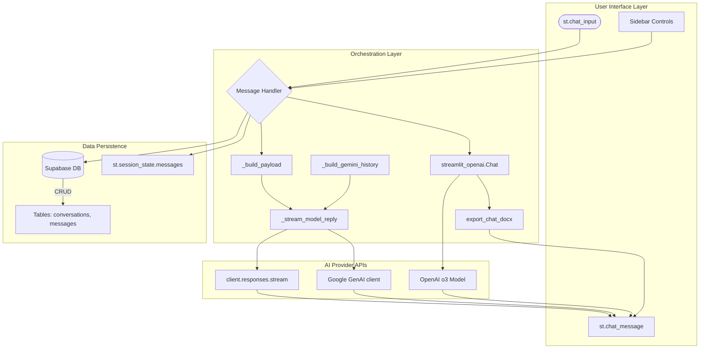
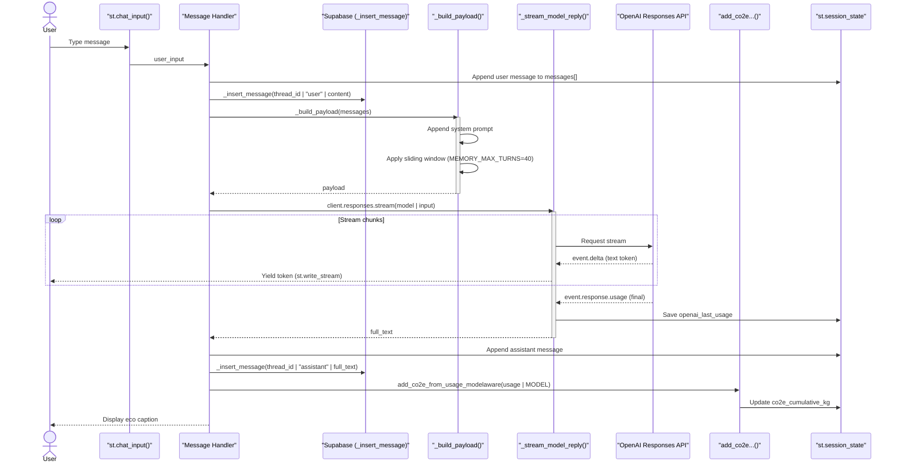

# 💬 Chat Systems

## Purpose and Scope
This document provides a technical overview of the conversational AI interfaces in the Gen AI Hub. The system implements four distinct chat interfaces, each serving different use cases: basic chat with persistence, advanced reasoning with tools, Gemini-powered chat, and transcript-based conversations.

This page focuses on the architectural patterns, data flows, and implementation details common across all chat systems.

## Chat System Overview
The application provides four chat interfaces differentiated by provider, model capabilities, and persistence strategy:

| Chat System | File | Model | Persistence | Key Features |
| :--- | :--- | :--- | :--- | :--- |
| **Simple Chat** | `simple_chat.py` | `gpt-4o-mini` | Supabase (conversations + messages) | Session-based conversation history, CO2e tracking, sliding window context |
| **Reasoning Chat** | `reasoning_chat.py` | `o3-mini` | Session-only | Code interpreter, file search, web search, DOCX export, `streamlit-openai` integration |
| **Gemini Chat** | `gemini_simple_chat.py` | `gemini-2.5-flash` | Supabase (conversations + messages) | Auto-thinking heuristics, dynamic temperature, model-aware CO2e |
| **Transcript Chat** | `transcribe_chat.py` | Various | Session-only | Audio transcript grounding, example prompts |

## High-Level Chat Architecture
The following diagram illustrates the data flow between the User Interface, Message Handlers, Data Persistence (Supabase), and External AI Providers.



## Authentication and Session Management

### Authentication Guard
All chat systems require authentication before execution. Each implements an identical auth guard pattern:

```python
if not getattr(st, "user", None) or not st.user.is_logged_in:
    st.stop()
```

### Key Session State Variables
The application maintains specific state variables to manage context and history across reruns.

| Variable | Used By | Purpose |
| :--- | :--- | :--- |
| `messages` | Simple Chat, Gemini Chat | List of `{"role": str, "content": str}` dicts for chat history |
| `active_thread_id` | Simple Chat, Gemini Chat | UUID of current Supabase conversation record |
| `_starting_new_chat` | Simple Chat, Gemini Chat | Flag indicating user initiated a new blank conversation |
| `reasoning_chat` | Reasoning Chat | `streamlit_openai.Chat` instance with tool configuration |
| `co2e_cumulative_kg` | Simple Chat, Gemini Chat | Running total of carbon emissions for the session |

## Message Processing Flow

### Simple Chat Message Flow
The following sequence diagram details the execution flow for `simple_chat.py`. It demonstrates how the system handles state management, database persistence (Supabase), context windowing, and streaming responses while tracking token usage for carbon footprint calculations.

