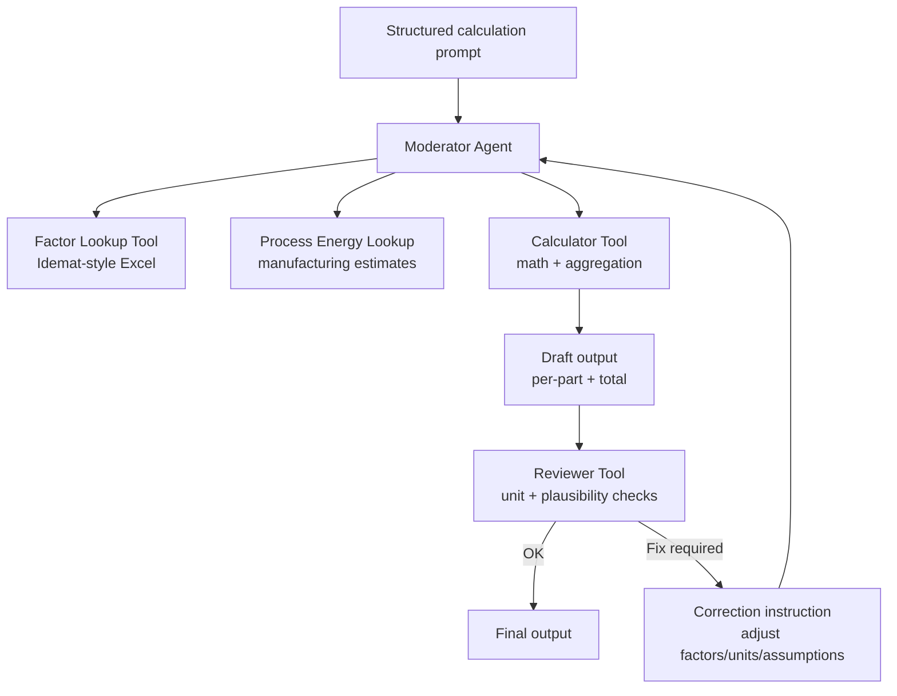
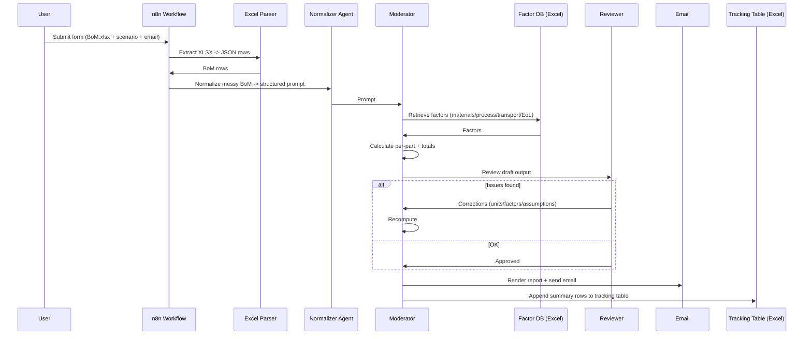

# 🧩 PCF One-Click Calculation — n8n Workflow Template

> **Portfolio Showcase:** An n8n workflow that converts a messy **BoM Excel upload** + minimal user inputs into an **sLCA-ready** calculation artifact by auto-matching **Idemat-style factors**, running a **review loop** to reduce errors, and publishing results to **Email + Excel tracking**.

---

## 🔹 TL;DR

- **Single upload experience:** BoM `.xlsx` + Scenario + Email.
- **Messy Excel → clean calculation prompt** using an LLM normalization step.
- **Idemat-style factor DB in Excel:** materials, grids, transport, end-of-life, and process energy estimates.
- **Moderator architecture:** Calculator tool generates a draft → Reviewer tool validates and triggers fixes if needed.
- **Operational outputs:** a human report emailed to the requester + a structured summary appended to a tracking table.

---

## Repo Structure (Suggested)

> You can keep everything in this README for temporary-chat sharing, then later split into real files.

- `docs/ARCHITECTURE.md` → system design + diagrams
- `docs/DATA_CONTRACT.md` → input BoM requirements + output schema
- `docs/SETUP.md` → import steps + credentials + workbook wiring
- `docs/TROUBLESHOOTING.md` → common failure modes + fixes
- `workflows/` → sanitized workflow JSON (optional/private)

---

# docs/ARCHITECTURE.md

## 1) Overview

**Goal:** reduce time + errors in streamlined LCA (sLCA) / PCF by automating:
- BoM ingestion,
- factor matching,
- arithmetic,
- sanity checks,
- and distribution.

This template follows a **Hub + tools** pattern:
- **Hub:** a single workflow entry point (form-triggered).
- **Tools:** normalization, factor selection, calculation, review, reporting, Excel writing.

---

## 2) High-Level Flow

```mermaid
flowchart LR
  A[Form Trigger\nUpload BoM.xlsx\nScenario + Email] --> B[Extract XLSX\n-> JSON rows]
  B --> C[Aggregate\n(all rows together)]
  C --> D[BoM Normalizer Agent\nmessy -> structured prompt]
  D --> E[Moderator Agent\ncalc + review orchestration]

  E --> F[Report Agent\nHTML/Markdown]
  F --> G[Send Email\n(Outlook/SMTP)]

  E --> H[Excel Update Agent\nextract summary table]
  H --> I[Parse JSON schema\n+ split rows]
  I --> J[Append rows to\nExcel tracking table]
```

---

## 3) Moderator Pattern (Reliability by Design)



---

## 4) Lifecycle (Sequence)



---

## 5) Extensibility: from PCF to multi-impact sLCA

1. Add impact columns to the factor DB (beyond kgCO2e).
2. Compute multiple impacts per part in the calculator tool.
3. Extend output schema + tracking table columns.
4. Add reviewer guardrails per category (ranges, units, completeness).

---

## 📌 Navigation

| Document | Purpose |
|---|---|
| [README.md](../README.md) | Project overview + single-page version |
| [docs/ARCHITECTURE.md](./ARCHITECTURE.md) | System diagrams + moderator pattern |
| [docs/DATA_CONTRACT.md](./DATA_CONTRACT.md) | Input/output schemas + factor DB contract |
| [docs/SETUP.md](./SETUP.md) | How to import + configure credentials/workbooks |
| [docs/TROUBLESHOOTING.md](./TROUBLESHOOTING.md) | Common failures + fixes |

---

# docs/DATA_CONTRACT.md

## 1) Input Contract — BoM Excel (Recommended Columns)

### Required (minimum)
- `Part` (string)
- `Weight_g` or `Weight_kg` (number)

### Strongly recommended
- `Assembly`
- `Material`
- `Manufacturing`
- `Country/Region`

### Transport (optional)
- `Transport_1_Mode`, `Transport_1_Distance_km`
- `Transport_2_Mode`, `Transport_2_Distance_km`

### End-of-Life (optional)
- `End_of_Life`

---

## 2) Factor DB Contract — Idemat-style Excel

Your factor workbook should represent:
- materials,
- manufacturing energy/process estimates,
- transport modes,
- end-of-life routes,
- regional electricity grids.

Recommended fields:
- `Factor_Name`
- `Category`
- `Unit`
- `Value_kgCO2e_per_unit`
- `Region` (optional)
- `Notes` (optional)

---

## 3) Output Contract — Summary Rows (Appended to Tracking Excel)

```json
[
  {
    "Part": "Example Part",
    "Assembly": "Example Assembly",
    "Part_Weight": 0,
    "Material_Type": "Example Material",
    "Material_Footprint": 0,
    "Manufacturing_Mode": "Example Process",
    "Manufacturing_Footprint": 0,
    "Distance_1": 0,
    "Transportation_Type_1": "Example Mode",
    "Distance_2": 0,
    "Transportation_Type_2": "Example Mode",
    "Transportation_Footprint": 0,
    "EOL_Type": "Example EoL",
    "End_of_Life_Footprint": 0,
    "Total_Footprint": 0
  },
  {
    "Part": "Grand Total",
    "Assembly": "",
    "Part_Weight": 0,
    "Material_Type": "",
    "Material_Footprint": 0,
    "Manufacturing_Mode": "",
    "Manufacturing_Footprint": 0,
    "Distance_1": 0,
    "Transportation_Type_1": "",
    "Distance_2": 0,
    "Transportation_Type_2": "",
    "Transportation_Footprint": 0,
    "EOL_Type": "",
    "End_of_Life_Footprint": 0,
    "Total_Footprint": 0
  }
]
```

Tracking metadata (recommended):
- `Concept` (Scenario)
- `Date` (timestamp)
- `Requested_by` (email prefix)

---

## 📌 Navigation

| Document | Purpose |
|---|---|
| [README.md](../README.md) | Project overview + single-page version |
| [docs/ARCHITECTURE.md](./ARCHITECTURE.md) | System diagrams + moderator pattern |
| [docs/DATA_CONTRACT.md](./DATA_CONTRACT.md) | Input/output schemas + factor DB contract |
| [docs/SETUP.md](./SETUP.md) | How to import + configure credentials/workbooks |
| [docs/TROUBLESHOOTING.md](./TROUBLESHOOTING.md) | Common failures + fixes |

---

# docs/SETUP.md

## 1) Import workflow

1. n8n → **Workflows** → **Import from file**
2. Select your template workflow JSON (sanitized)

---

## 2) Credentials

You’ll need:
- **Microsoft Excel 365 (Graph)**: factor DB + tracking table
- **Email provider**: Outlook (Graph) or Gmail/SMTP
- **LLM provider**: OpenAI/compatible for agent nodes

---

## 3) Configure workbooks

### Factor DB workbook
Point the “get rows” tool to your factor workbook (materials/process/transport/EoL/grid).

### Tracking workbook/table
Point the “append rows” node to:
- correct workbook + worksheet
- correct **Excel table**
- matching column names

---

## 4) Test run checklist

- email report renders correctly
- tracking table rows are appended
- “Grand Total” is present
- units look correct (g/kg, km)

---

## 📌 Navigation

| Document | Purpose |
|---|---|
| [README.md](../README.md) | Project overview + single-page version |
| [docs/ARCHITECTURE.md](./ARCHITECTURE.md) | System diagrams + moderator pattern |
| [docs/DATA_CONTRACT.md](./DATA_CONTRACT.md) | Input/output schemas + factor DB contract |
| [docs/SETUP.md](./SETUP.md) | How to import + configure credentials/workbooks |
| [docs/TROUBLESHOOTING.md](./TROUBLESHOOTING.md) | Common failures + fixes |

---

# docs/TROUBLESHOOTING.md

## “Extract from File” returns empty rows
- Confirm `.xlsx`
- Confirm header row exists
- Confirm upload field mapping matches binary property

---

## Factor matches are irrelevant
- Use more specific `Material` / `Manufacturing`
- Add `Country/Region`
- Add internal `Factor_ID` and prefer exact matches (best)

---

## Reviewer keeps looping
- Unit mismatch (g vs kg) is common
- Missing distances with transport modes
- Totals not summing due to parse instability

Fix by standardizing units + providing complete transport/EoL inputs.

---

## Email didn’t arrive
- Credential expired / blocked by policy
- Spam/quarantine

---

## Excel append fails
- Destination isn’t an Excel **Table**
- Column name mismatch
- Numeric fields are strings

---

## 📌 Navigation

| Document | Purpose |
|---|---|
| [README.md](../README.md) | Project overview + single-page version |
| [docs/ARCHITECTURE.md](./ARCHITECTURE.md) | System diagrams + moderator pattern |
| [docs/DATA_CONTRACT.md](./DATA_CONTRACT.md) | Input/output schemas + factor DB contract |
| [docs/SETUP.md](./SETUP.md) | How to import + configure credentials/workbooks |
| [docs/TROUBLESHOOTING.md](./TROUBLESHOOTING.md) | Common failures + fixes |

---

# README.md (this file) — Navigation Table

| Document | Purpose |
|---|---|
| [README.md](./README.md) | Project overview + single-page version |
| [docs/ARCHITECTURE.md](./docs/ARCHITECTURE.md) | System diagrams + moderator pattern |
| [docs/DATA_CONTRACT.md](./docs/DATA_CONTRACT.md) | Input/output schemas + factor DB contract |
| [docs/SETUP.md](./docs/SETUP.md) | How to import + configure credentials/workbooks |
| [docs/TROUBLESHOOTING.md](./docs/TROUBLESHOOTING.md) | Common failures + fixes |
