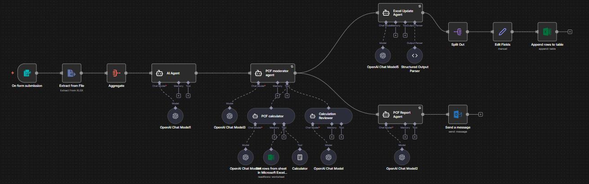
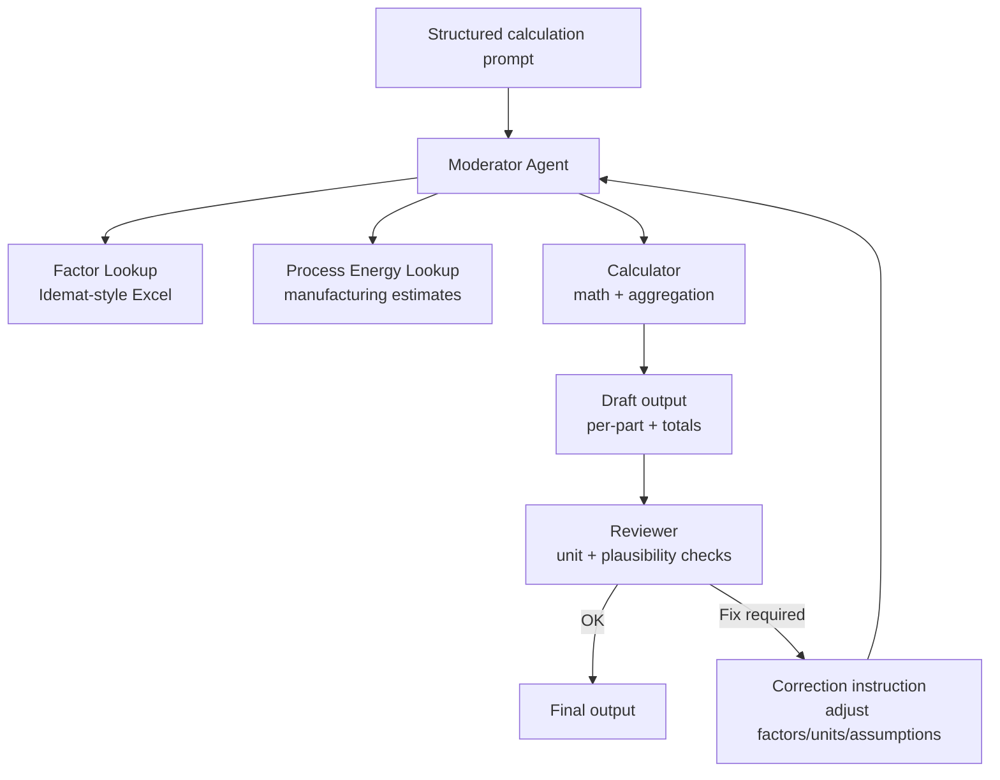
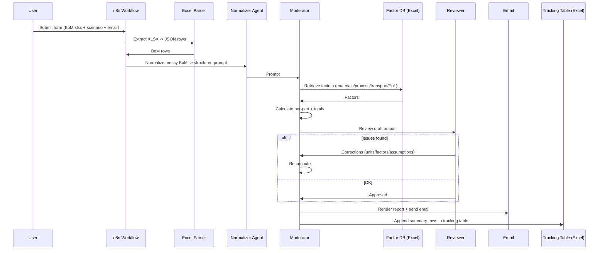

# 🧩 PCF One-Click Calculation — n8n Workflow (Portfolio Explanation)

> **Portfolio Showcase:** An n8n workflow that converts a messy **BoM Excel upload** + minimal user inputs into an **sLCA-ready** calculation artifact by auto-matching **Idemat-style factors**, running a **review loop** to reduce errors, and publishing results to **Email + Excel tracking**.

---



## 🔹 TL;DR

- **One upload experience:** BoM `.xlsx` + Scenario + Email.
- **Messy Excel → clean calculation prompt** via LLM normalization.
- **Idemat-style factor DB in Excel:** materials, grids, transport, end-of-life, and process energy estimates.
- **Moderator architecture:** Calculator produces draft → Reviewer validates and triggers corrections.
- **Two outputs:** email report + Excel tracking table append.

---

## 1) Problem & Goal

**Problem:** BoMs rarely arrive in a calculation-ready state. Common issues include mixed units, missing fields, and ambiguous material/process naming. As a result, engineers spend disproportionate time on non-value-add work:
- hunting down the right factors,
- correcting unit and formatting errors,
- filling gaps in transport and end-of-life assumptions,
- manually compiling reports and updating tracking sheets.

This also creates **avoidable delays** when inputs are incomplete—work stalls while teams wait for clarifications, despite engineering time being the bottleneck.

**Goal:** Make sLCA/PCF generation **repeatable** and **fast** with a single, reliable pipeline:
- **upload → compute → review → ideate/share**
- fewer manual steps, fewer handoff delays, and fewer silent spreadsheet errors.

## 2) Scope & Limitations

> A fair critique of early PCF tools is: “you can’t assume your way to an LCA.” That’s correct—and this workflow does **not** claim otherwise.

This is a **screening-level / streamlined** estimate used at the **start of product ideation**, when the alternative is usually *no estimate at all* (or weeks of manual back-and-forth). The intent is to provide a **directional signal** for decision-making before anything is manufactured.

**What it is good for**
- comparing design concepts (A vs B),
- identifying likely hotspots (materials vs manufacturing vs transport),
- highlighting missing data and the assumptions driving the result.

**What it is not**
- a compliance-grade LCA,
- suitable for public footprint claims,
- a substitute for supplier-specific primary data.

As real inputs become available (supplier material specs, real process routes, logistics), the same pipeline can be rerun with fewer assumptions and improved accuracy.


---

## 3) What the workflow does (Inputs → Outputs)

### Inputs (web form)
- BoM file upload (single `.xlsx`)
- Scenario name (concept identifier)
- Recipient email

### Outputs
- **Human-readable report** (HTML/Markdown) emailed to the requester
- **Machine-readable summary table** appended to an Excel tracking table (per-part rows + grand total)

---

## 4) Architecture (Hub + Tools)

This template follows a **Hub + toolchain** pattern:

- **Hub (workflow orchestrator):**
  - receives the form submission,
  - parses the BoM,
  - orchestrates calculation + publishing.

- **Tools/agents (spokes):**
  1. BoM Normalizer (messy rows → structured prompt)
  2. Factor Lookup (Idemat-style Excel)
  3. PCF Calculator (math + aggregation)
  4. Calculation Reviewer (sanity checks + correction loop)
  5. Report Renderer (HTML email)
  6. Excel Writer (summary schema → append to tracking table)

---

## 5) High-Level Flow Diagram

```mermaid
flowchart LR
  A[Form Trigger\nUpload BoM.xlsx\nScenario + Email] --> B[Extract XLSX\n-> JSON rows]
  B --> C[Aggregate\n(all rows together)]
  C --> D[BoM Normalizer Agent\nmessy -> structured prompt]
  D --> E[Moderator Agent\ncalc + review orchestration]

  E --> F[Report Agent\nHTML/Markdown]
  F --> G[Send Email\n(Outlook/SMTP)]

  E --> H[Excel Update Agent\nextract summary table]
  H --> I[Parse JSON schema\n+ split rows]
  I --> J[Append rows to\nExcel tracking table]
```

---

## 6) The Core Reliability Mechanism: Moderator + Review Loop

The most important design decision is **never trusting a first-pass calculation**.

- The **Calculator** tries to select factors + compute results.
- The **Reviewer** checks plausibility and correctness.
- If issues exist, it triggers a correction prompt and reruns.



**Reviewer checks typically include:**
- unit mismatches (g vs kg),
- missing factors (material/process/transport/EoL),
- totals not summing correctly,
- outlier detection (tiny part, huge impact),
- inconsistent transport distances vs modes.

---

## 7) Lifecycle (Sequence Diagram)



---

## 8) Data Contracts

### 8.1 Input BoM Excel (recommended columns)

This workflow tolerates messy BoMs, but matching is best when you include:

**Minimum**
- `Part`
- `Weight_g` or `Weight_kg`

**Recommended**
- `Assembly`
- `Material`
- `Manufacturing`
- `Country/Region`

**Optional (transport/EoL)**
- `Transport_1_Mode`, `Transport_1_Distance_km`
- `Transport_2_Mode`, `Transport_2_Distance_km`
- `End_of_Life`

> Extra columns are fine. The normalizer step can ignore or leverage them.

---

### 8.2 Factor Database (Idemat-style Excel)

The factor workbook typically includes:
- **Materials**: kgCO2e per kg
- **Transport**: kgCO2e per ton-km (or per km) by mode
- **End-of-life**: kgCO2e per kg by route
- **Electricity grids**: kgCO2e per kWh by region
- **Manufacturing energy estimates**: process energy per kg/part + mapping to grid

Recommended fields:
- `Factor_Name`
- `Category` (Material / Process / Transport / EoL / Grid)
- `Unit`
- `Value_kgCO2e_per_unit`
- `Region` (optional)
- `Notes` (optional)

**Best practice (reduces errors):**
- add `Factor_ID` to BoM rows if you already have internal mappings
- prefer exact ID matches before fuzzy name matching

---

### 8.3 Output Summary Rows (appended to tracking table)

The workflow produces a per-part summary shaped like:

```json
[
  {
    "Part": "Example Part",
    "Assembly": "Example Assembly",
    "Part_Weight": 0,
    "Material_Type": "Example Material",
    "Material_Footprint": 0,
    "Manufacturing_Mode": "Example Process",
    "Manufacturing_Footprint": 0,
    "Distance_1": 0,
    "Transportation_Type_1": "Example Mode",
    "Distance_2": 0,
    "Transportation_Type_2": "Example Mode",
    "Transportation_Footprint": 0,
    "EOL_Type": "Example EoL",
    "End_of_Life_Footprint": 0,
    "Total_Footprint": 0
  },
  {
    "Part": "Grand Total",
    "Assembly": "",
    "Part_Weight": 0,
    "Material_Type": "",
    "Material_Footprint": 0,
    "Manufacturing_Mode": "",
    "Manufacturing_Footprint": 0,
    "Distance_1": 0,
    "Transportation_Type_1": "",
    "Distance_2": 0,
    "Transportation_Type_2": "",
    "Transportation_Footprint": 0,
    "EOL_Type": "",
    "End_of_Life_Footprint": 0,
    "Total_Footprint": 0
  }
]
```

Recommended tracking metadata:
- `Concept` = Scenario name
- `Date` = run timestamp
- `Requested_by` = email prefix (before `@`)

---

## 9) Setup (for your own n8n instance)

1. Import the workflow JSON (sanitized if public).
2. Configure credentials:
   - Microsoft Excel 365 (Graph) for factor DB + tracking table
   - Outlook (or Gmail/SMTP) for email sending
   - LLM provider credentials for all agent nodes
3. Point nodes to your workbooks:
   - factor DB workbook (Idemat-style)
   - tracking workbook/table
4. Run a small test BoM (2–3 rows), verify:
   - email report arrives
   - table rows appended
   - “Grand Total” exists
   - units are correct

---

## 10) Troubleshooting (common issues)

### Extract returns empty rows
- Not a real `.xlsx` file
- Missing header row
- Upload field mapping mismatch

### Factor matching looks wrong
- Material/process names too vague
- Missing region
- No internal factor IDs

Fix: add specificity + region + (best) a `Factor_ID`.

### Reviewer loops repeatedly
- g/kg mismatch
- missing distances with transport mode present
- unstable report-to-table extraction headings

Fix: standardize units, ensure complete transport fields, stabilize headings.

### Excel append fails
- Destination is not an Excel **Table**
- Column name mismatch
- Numeric fields are strings

Fix: convert to a Table, align columns, enforce structured parsing.
