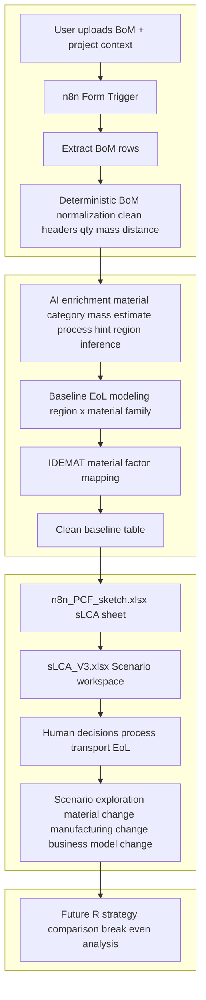

# PCF Automation Wiki  
(n8n → n8n_PCF_sketch → sLCA_V3)

---

## TL;DR
This system is designed to **define, clean, and confirm a baseline Product Carbon Footprint (PCF)** from messy engineering BoMs, and then **support structured scenario exploration**.  

It automates the “painful but non-differentiating” work (data cleaning, normalization, baseline assumptions), so humans can focus on:
- confirming a credible baseline,
- identifying leverage points (what *can* change vs what *cannot*),
- and building future scenarios (materials, manufacturing, transport, business models, R-strategies).

This is **not a reporting tool**.  
It is a **design- and decision-support system for PCF**.

---

## Scope

### In scope (current)
- Ingest BoM from `.xlsx`
- Normalize and clean BoM structure deterministically
- Infer missing PCF-relevant attributes (material category, mass, region, baseline transport)
- Map materials to IDEMAT factors (baseline material LCI)
- Model deterministic baseline EoL when not truly declared
- Write a clean, structured baseline table to `n8n_PCF_sketch.xlsx` (`sLCA` sheet)
- Feed `sLCA_V3.xlsx`, which is used as the **working scenario model**

### Explicitly NOT in scope (current)
- Automated PCF reporting or dashboards
- Automated decision-making or optimization
- Final authoritative PCF numbers for disclosure
- Full automation of:
  - manufacturing process choice
  - EoL strategy choice
  - transport leg allocation

Those remain **human decisions by design**.

---

## Use Case (Core Intent)

### 1. Define and confirm a baseline PCF
- Establish a **credible, conservative baseline**:
  - materials
  - mass
  - geography
  - transport distance
  - default EoL
- Make assumptions explicit and traceable
- Ensure consistency across projects

This baseline answers:
> “If we did nothing special, what is the PCF of this product?”

---

### 2. Identify and ideate leverage points
Once the baseline exists, the system helps identify:
- What dominates PCF?
  - material production?
  - manufacturing process?
  - transport?
  - EoL?
- Which parameters are:
  - **fixed** (cannot realistically change)
  - **flexible** (design, sourcing, or business decisions)

Typical leverage questions:
- Can material be substituted?
- Can mass be reduced?
- Can manufacturing change (subtractive → forming, additive)?
- Can transport mode or distance change?
- Can lifetime or reuse be extended?

---

### 3. Build future scenarios
Using the same cleaned structure, humans create **alternative scenarios**:
- Different materials
- Different manufacturing processes
- Different sourcing regions
- Different transport strategies
- Different business models (e.g. return logistics, refurbishment, reuse)

Each scenario stays comparable because:
- The baseline structure is fixed
- Only controlled parameters change

---

### 4. Evaluate R-strategies and break-even logic (future direction)
A major future extension is **R-strategy evaluation**:
- Reuse
- Repair
- Refurbish
- Remanufacture
- Return logistics

Key questions this enables:
- How much additional impact does return logistics add?
- When does reuse/refurbishment “pay back” its extra transport and processing?
- After how many cycles does an R-model outperform the baseline?
- Where is the **break-even point** between:
  - current linear model
  - circular / R-based model

This is intentionally built on top of a **solid baseline**, not instead of it.

---

## Goal

### Primary goal
Create a **high-quality baseline PCF** quickly and reproducibly, so teams can move from:
> “Do we even trust this data?”  
to  
> “What should we change?”

### Secondary goal
Enable structured comparison between:
- baseline vs improved designs
- linear vs circular business models
- short-term vs long-term strategies

---

## Value

### What it replaces
- Manual BoM cleaning
- Repeated unit conversions
- Ad-hoc Googling of factors
- Spreadsheet refactoring
- Implicit, undocumented assumptions

### What it enables
- Faster baseline creation (days → minutes)
- Consistent assumptions across projects
- Early-stage PCF thinking (before detailed LCA)
- Design-driven sustainability discussions

---

## Files and Data Flow

### Files
1. **`n8n_PCF_sketch.xlsx`**
   - System-of-record for normalized baseline data
   - Sheet: `sLCA`
   - Written by n8n (treated as read-only output)

2. **`sLCA_V3.xlsx`**
   - Scenario playground
   - Automatically captures updated baseline table
   - Humans modify process, transport legs, EoL, and scenarios here

3. **BoM input file**
   - Raw engineering BoM uploaded by user

---

## Limitations (by design)

1. **Human confirmation required**
   - Manufacturing processes
   - EoL strategies
   - Transport leg allocation

2. **Baseline-first philosophy**
   - Automation produces a *starting point*, not “the truth”
   - Conservative defaults are preferred over optimistic guesses

3. **Data quality dependency**
   - IDEMAT mapping quality depends on:
     - material clarity
     - correct categorization
     - database coverage

4. **No optimization engine**
   - The system does not decide “best” options
   - It enables humans to compare options

---

## What is determined by us (deterministic system logic)

### Deterministic rules
- Header detection and BoM normalization
- Quantity, mass, distance parsing
- Unit normalization and validation
- Country → region mapping
- Baseline transport distance rules
- EoL modeling tables (region × material family)
- Guardrails (e.g. distance = 0 only when destination unknown)

### Deterministic defaults
- Conservative assumptions when data is missing
- Explicit logging of every fallback
- Stable behavior (same input → same output)

---

## What is determined by AI

### AI inference (bounded and constrained)
- Interpreting messy material descriptions
- Inferring material categories
- Suggesting manufacturing process classes (coarse)
- Estimating mass when absent (rule-based heuristics)
- Identifying assemblies vs components

### AI matching
- Selecting best-fit IDEMAT factors from candidate sets
- Flagging uncertainty instead of forcing bad matches

AI **does not**:
- Choose final processes
- Choose final EoL strategies
- Optimize scenarios
- Make business decisions

---

## How this is helpful

### For baseline definition
- Quickly establishes a PCF baseline that is:
  - clean
  - consistent
  - auditable
- Makes assumptions visible instead of hidden in spreadsheets

### For leverage point identification
- Highlights PCF hotspots
- Clarifies which parameters are changeable
- Provides a shared reference for design discussions

### For scenario building
- Enables “what if” exploration without rebuilding models
- Keeps scenarios comparable
- Supports long-term thinking (e.g. circularity)

---

## Human activities (essential and intentional)

### Human inputs
- Upload BoM
- Provide project context (country, city, notes)
- Select and confirm:
  - manufacturing processes
  - transport legs
  - EoL strategies

### Human thinking tasks
- Decide what can realistically change
- Evaluate trade-offs (cost, feasibility, PCF)
- Interpret results in context

### Human responsibility
- Final validation of baseline
- Approval of scenario assumptions
- Decision-making based on outputs

---

## Supported capabilities (current)

### Transportation
- Three legs supported in `sLCA_V3`:
  - land
  - sea
  - air
- Baseline distance inferred automatically
- Final allocation chosen by humans

### Manufacturing processes
- Supported categories include:
  - subtractive
  - additive
  - welding
  - laser cutting
  - painting / surface treatment
- Final process selection remains human-controlled

---

## Operating principles

- Baseline before optimization
- Determinism before intelligence
- Transparency over false precision
- Humans decide, system prepares
- Circularity is evaluated *relative to a baseline*, not in isolation

---

## Mermaid Diagram (Conceptual Flow)

---

## Future direction (intended evolution)

- Manufacturing process factors added to PCF (material + process)
- Automated activity-amount estimation (kg removed, m² painted, etc.)
- Transport leg splitting rules
- Scenario delta calculation (baseline vs alternative)
- R-strategy modeling with break-even point detection
- Lifetime-based PCF comparison (one-time vs multi-cycle)

---

## Summary
This system is a **baseline and scenario engine**, not a reporting tool.  
Its strength is not in producing a single number, but in enabling **better questions, better comparisons, and better decisions** about how to reduce PCF over time.

