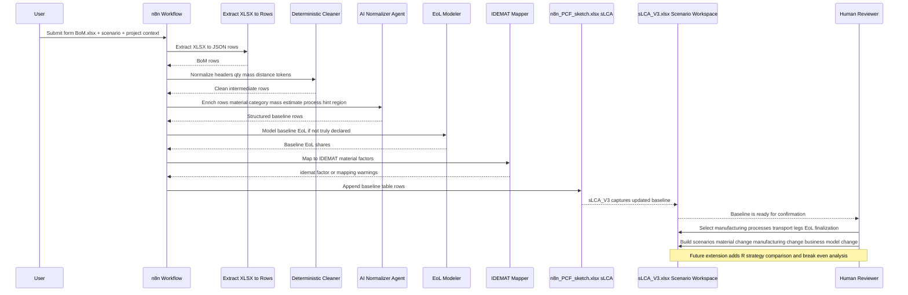
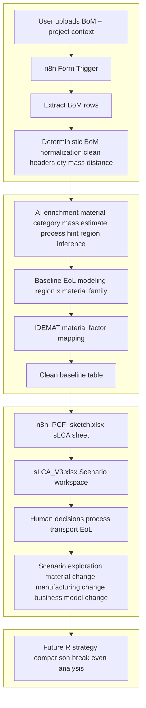

# PCF Automation Wiki  
(n8n → n8n_PCF_sketch → sLCA_V3)

---

## TL;DR
This system is designed to **define, clean, and confirm a baseline Product Carbon Footprint (PCF)** from messy engineering BoMs, and then **support structured scenario exploration**.  

It automates the “painful but non-differentiating” work (data cleaning, normalization, baseline assumptions), so humans can focus on:
- confirming a credible baseline,
- identifying leverage points (what *can* change vs what *cannot*),
- and building future scenarios (materials, manufacturing, transport, business models, R-strategies).

This is **not a reporting tool**.  
It is a **design- and decision-support system for PCF**.

---

## Scope

### In scope (current)
- Ingest BoM from `.xlsx`
- Normalize and clean BoM structure deterministically
- Infer missing PCF-relevant attributes (material category, mass, region, baseline transport)
- Map materials to IDEMAT factors (baseline material LCI)
- Model deterministic baseline EoL when not truly declared
- Write a clean, structured baseline table to `n8n_PCF_sketch.xlsx` (`sLCA` sheet)
- Feed `sLCA_V3.xlsx`, which is used as the **working scenario model**

### Explicitly NOT in scope (current)
- Automated PCF reporting or dashboards
- Automated decision-making or optimization
- Final authoritative PCF numbers for disclosure
- Full automation of:
  - manufacturing process choice
  - EoL strategy choice
  - transport leg allocation

Those remain **human decisions by design**.

---

## Use Case (Core Intent)

### 1. Define and confirm a baseline PCF
- Establish a **credible, conservative baseline**:
  - materials
  - mass
  - geography
  - transport distance
  - default EoL
- Make assumptions explicit and traceable
- Ensure consistency across projects

This baseline answers:
> “If we did nothing special, what is the PCF of this product?”

---

### 2. Identify and ideate leverage points
Once the baseline exists, the system helps identify:
- What dominates PCF?
  - material production?
  - manufacturing process?
  - transport?
  - EoL?
- Which parameters are:
  - **fixed** (cannot realistically change)
  - **flexible** (design, sourcing, or business decisions)

Typical leverage questions:
- Can material be substituted?
- Can mass be reduced?
- Can manufacturing change (subtractive → forming, additive)?
- Can transport mode or distance change?
- Can lifetime or reuse be extended?

---

### 3. Build future scenarios
Using the same cleaned structure, humans create **alternative scenarios**:
- Different materials
- Different manufacturing processes
- Different sourcing regions
- Different transport strategies
- Different business models (e.g. return logistics, refurbishment, reuse)

Each scenario stays comparable because:
- The baseline structure is fixed
- Only controlled parameters change

---

### 4. Evaluate R-strategies and break-even logic (future direction)
A major future extension is **R-strategy evaluation**:
- Reuse
- Repair
- Refurbish
- Remanufacture
- Return logistics

Key questions this enables:
- How much additional impact does return logistics add?
- When does reuse/refurbishment “pay back” its extra transport and processing?
- After how many cycles does an R-model outperform the baseline?
- Where is the **break-even point** between:
  - current linear model
  - circular / R-based model

This is intentionally built on top of a **solid baseline**, not instead of it.

---

## Goal

### Primary goal
Create a **high-quality baseline PCF** quickly and reproducibly, so teams can move from:
> “Do we even trust this data?”  
to  
> “What should we change?”

### Secondary goal
Enable structured comparison between:
- baseline vs improved designs
- linear vs circular business models
- short-term vs long-term strategies

---

## Value

### What it replaces
- Manual BoM cleaning
- Repeated unit conversions
- Ad-hoc Googling of factors
- Spreadsheet refactoring
- Implicit, undocumented assumptions

### What it enables
- Faster baseline creation (days → minutes)
- Consistent assumptions across projects
- Early-stage PCF thinking (before detailed LCA)
- Design-driven sustainability discussions

---

## Sequence Diagram

## Files and Data Flow

### Files
1. **`n8n_PCF_sketch.xlsx`**
   - System-of-record for normalized baseline data
   - Sheet: `sLCA`
   - Written by n8n (treated as read-only output)

2. **`sLCA_V3.xlsx`**
   - Scenario playground
   - Automatically captures updated baseline table
   - Humans modify process, transport legs, EoL, and scenarios here

3. **BoM input file**
   - Raw engineering BoM uploaded by user

---

## Limitations (by design)

1. **Human confirmation required**
   - Manufacturing processes
   - EoL strategies
   - Transport leg allocation

2. **Baseline-first philosophy**
   - Automation produces a *starting point*, not “the truth”
   - Conservative defaults are preferred over optimistic guesses

3. **Data quality dependency**
   - IDEMAT mapping quality depends on:
     - material clarity
     - correct categorization
     - database coverage

4. **No optimization engine**
   - The system does not decide “best” options
   - It enables humans to compare options

---

## What is determined by us (deterministic system logic)

### Deterministic rules
- Header detection and BoM normalization
- Quantity, mass, distance parsing
- Unit normalization and validation
- Country → region mapping
- Baseline transport distance rules
- EoL modeling tables (region × material family)
- Guardrails (e.g. distance = 0 only when destination unknown)

### Deterministic defaults
- Conservative assumptions when data is missing
- Explicit logging of every fallback
- Stable behavior (same input → same output)

---

## What is determined by AI

### AI inference (bounded and constrained)
- Interpreting messy material descriptions
- Inferring material categories
- Suggesting manufacturing process classes (coarse)
- Estimating mass when absent (rule-based heuristics)
- Identifying assemblies vs components

### AI matching
- Selecting best-fit IDEMAT factors from candidate sets
- Flagging uncertainty instead of forcing bad matches

AI **does not**:
- Choose final processes
- Choose final EoL strategies
- Optimize scenarios
- Make business decisions

---

## How this is helpful

### For baseline definition
- Quickly establishes a PCF baseline that is:
  - clean
  - consistent
  - auditable
- Makes assumptions visible instead of hidden in spreadsheets

### For leverage point identification
- Highlights PCF hotspots
- Clarifies which parameters are changeable
- Provides a shared reference for design discussions

### For scenario building
- Enables “what if” exploration without rebuilding models
- Keeps scenarios comparable
- Supports long-term thinking (e.g. circularity)

---

## Human activities (essential and intentional)

### Human inputs
- Upload BoM
- Provide project context (country, city, notes)
- Select and confirm:
  - manufacturing processes
  - transport legs
  - EoL strategies

### Human thinking tasks
- Decide what can realistically change
- Evaluate trade-offs (cost, feasibility, PCF)
- Interpret results in context

### Human responsibility
- Final validation of baseline
- Approval of scenario assumptions
- Decision-making based on outputs

---

## Supported capabilities (current)

### Transportation
- Three legs supported in `sLCA_V3`:
  - land
  - sea
  - air
- Baseline distance inferred automatically
- Final allocation chosen by humans

### Manufacturing processes
- Supported categories include:
  - subtractive
  - additive
  - welding
  - laser cutting
  - painting / surface treatment
- Final process selection remains human-controlled

---

## Operating principles

- Baseline before optimization
- Determinism before intelligence
- Transparency over false precision
- Humans decide, system prepares
- Circularity is evaluated *relative to a baseline*, not in isolation

---

## Mermaid Diagram (Conceptual Flow)

---

## Future direction (intended evolution)

- Manufacturing process factors added to PCF (material + process)
- Automated activity-amount estimation (kg removed, m² painted, etc.)
- Transport leg splitting rules
- Scenario delta calculation (baseline vs alternative)
- R-strategy modeling with break-even point detection
- Lifetime-based PCF comparison (one-time vs multi-cycle)

---

## Summary
This system is a **baseline and scenario engine**, not a reporting tool.  
Its strength is not in producing a single number, but in enabling **better questions, better comparisons, and better decisions** about how to reduce PCF over time.

# Appendix — Baseline Assumptions Embedded in the Workflow
(derived from prompt logic + deterministic code nodes)

This appendix documents the **baseline assumptions that are hard-coded or implicitly enforced** by the current n8n workflow (ExtractData, BoM Maker prompt, EoL_Modeler_Deterministic, IDEMAT Agent).  

These assumptions define what “baseline PCF” means in this system.

They are **intentional**, **conservative**, and **designed to be overridden by humans** when better information is available.

---

## A. Structural & Modeling Philosophy (Meta-Assumptions)

1. **Baseline-first principle**
   - The workflow always aims to produce *a complete baseline*, even if inputs are incomplete.
   - Missing data is filled with deterministic assumptions rather than leaving blanks.

2. **Determinism over creativity**
   - Same inputs must produce the same outputs.
   - AI is constrained by rules, schemas, and fallback logic.

3. **Conservative defaults**
   - Defaults are chosen to avoid optimistic underestimation.
   - Where uncertainty exists, assumptions are logged explicitly.

4. **Explicit assumption logging**
   - Every inferred or assumed value must be recorded in:
     - `applied_assumptions`
     - or `mapping_warnings`

---

## B. BoM Structure & Quantity Assumptions

### B1. Unit of Measure (UOM)
**Assumption**
- If UOM is missing, invalid, or polluted by transport tokens (e.g. “Air”, “Truck”), UOM is forced to `ea`.

**Rationale**
- Engineering BoMs often misuse UOM columns.
- `ea` is the safest baseline for component counting.

**Logged as**
- `uom.cleaned: invalid_mode_token->ea`
- or `uom.assumed: ea`

---

### B2. Quantity
**Assumption**
- If quantity is missing or unparsable → quantity = 1.

**Rationale**
- Prevents accidental zero-mass or zero-impact rows.
- Reflects “at least one component exists”.

---

## C. Mass & Weight Assumptions

### C1. Priority order for mass determination
1. Explicit weight in grams (`Weight (g)`)
2. Mass-based UOM (g/kg/mg × quantity)
3. Size-class estimation (last resort)

---

### C2. Size-class mass estimation
When no mass is available, the system:
- Classifies parts into size classes based on keywords:
  - micro (screws, washers)
  - small (clips, sensors)
  - medium (modules, housings)
  - large (frames, large casings)
  - bulk

**Material density table is fixed**, e.g.:
- Steel: 7.8 g/cm³
- Aluminum: 2.7 g/cm³
- Plastics: ~0.9–1.4 g/cm³
- Electronics: 2.0 g/cm³
- Assembly: 0.9 g/cm³
- Unknown: 1.0 g/cm³

**Rationale**
- Ensures non-zero mass baseline
- Avoids “free” components

**Logged as**
- `mass.estimated: size-class:<class> (<material_category>)`

---

## D. Material Identification Assumptions

### D1. Material category inference
**Rules**
- Material category is inferred from:
  1. Explicit material fields
  2. Material text
  3. Part name / description keywords

**Important constraints**
- Stainless steel is never collapsed into generic steel.
- Polyamide (nylon) is never downgraded to polypropylene.
- Mixed materials trigger `composite`.

**Fallback**
- If nothing matches → `material_category = unknown`

**Rationale**
- Avoids over-simplification
- Preserves material hierarchy critical for PCF

---

### D2. Composite & assembly handling
**Assumption**
- Composite or assembly-like rows should not be forced onto pure material factors.

**Result**
- IDEMAT mapping may intentionally return `null`
- A warning is added instead of a wrong factor

---

## E. Manufacturing Process Assumptions

### E1. Process presence is mandatory
**Assumption**
- `manufacturing_process` is never left empty.

**If missing**
- A coarse process class is inferred based on:
  - material category
  - part keywords

Examples:
- Metal + milling/turning keywords → “Machining”
- Plastic + housing/cover → “Injection molding”
- Electronics → “Electronics assembly”
- Assembly rows → “Manual/mechanical assembly”

**Rationale**
- Process is required later for scenario thinking
- Baseline process ≠ final process

**Logged as**
- `process.inferred: <rule>`

---

### E2. Process precision assumption
**Assumption**
- Baseline process classification is *intentionally coarse*.

**Meaning**
- “Machining” ≠ milling vs turning vs drilling
- Precision is deferred to human selection in Excel

---

## F. Manufacturing Location & Region Assumptions

### F1. Manufacturing country
**Priority order**
1. Explicit manufacturing region/country field
2. Manufacturing notes (“Made in …”)
3. Fallback

**Fallback**
- If still unknown → `mfg_country_code = DE`

**Rationale**
- Provides a European industrial baseline
- Avoids leaving region undefined

**Logged as**
- `mfg_country.assumed: DE`

---

### F2. Manufacturing region
Derived deterministically from country:
- Europe
- Asia
- North America
- South America
- Africa
- Oceania

**If not mappable**
- `mfg_region = UNSPECIFIED`

---

## G. Destination & Transport Assumptions

### G1. Destination (project country)
**Priority order**
1. Form input (project_country)
2. Explicit tokens in `additional_note`
3. Natural-language hints (“final assembly in …”)
4. Fallback

**Fallback**
- `ship_to_country = UNSPECIFIED`

---

### G2. Transport distance
**Rules**
- If destination is UNSPECIFIED:
  - distance = 0
  - mode = road
- If same country:
  - distance = 400 km
- If same continent:
  - distance = 900 km
- If intercontinental:
  - distance = 7000 km

**Rationale**
- Produces a conservative, banded estimate
- Avoids false precision

---

### G3. Transport mode
**Hard rules**
- Same-country transport can never be air or sea
- Intercontinental defaults to sea
- Air only allowed if:
  - explicitly mentioned AND
  - low mass (< 2 kg)

**Rationale**
- Prevents unrealistic baseline logistics
- Keeps air freight exceptional

---

## H. End-of-Life (EoL) Assumptions

### H1. Declared vs modeled EoL
**Critical assumption**
- `DeclaredByUser` with 0/0/0/100 is treated as **NOT truly declared**.

**Meaning**
- Placeholder landfill-only entries are overridden.

---

### H2. Modeled EoL logic
If not truly declared:
- EoL is derived from:
  - region (based on destination or manufacturing)
  - material family (steel, aluminum, plastics, etc.)

Examples:
- Europe + steel → ~95% recycle
- Asia + plastics → low recycle, high landfill
- Assembly → mixed handling

**Fallback**
- If region or material unknown:
  - 100% landfill

**Rationale**
- Reflects regional infrastructure differences
- Conservative for early-stage PCF

---

## I. IDEMAT Mapping Assumptions

### I1. Material-first baseline
**Assumption**
- Baseline PCF uses **material production factors**, not process factors (yet).

---

### I2. One-shot lookup
**Rule**
- IDEMAT search is executed exactly once per part.

**Rationale**
- Prevents “search until something fits”
- Forces transparent failure when no match exists

---

### I3. Region sensitivity
**Examples**
- Steel in Europe → prefer “steel market mix Europe”
- Aluminum → prefer “aluminium” spelling always

**Fallback**
- If no compatible factor found:
  - All `idemat_*` fields remain null
  - Warning is added

---

## J. Cost Assumptions

**Assumption**
- If no unit cost is provided:
  - unit_cost_eur = 0
  - total_cost_eur = 0

**Rationale**
- PCF baseline should not invent economic data

---

## K. Summary of Baseline Assumption Philosophy

In short, the baseline produced by this system assumes:

- A **generic, conservative industrial reality**
- **No optimization**
- **No circularity by default**
- **No supplier-specific advantages**
- **No air freight unless explicitly justified**

This makes the baseline:
- Comparable across projects
- Suitable as a reference point
- A stable anchor for scenario exploration

Any improvement (lighter material, better process, reuse, circular models) must **earn its benefit relative to this baseline**, which is exactly the intent of the system.

--- 

